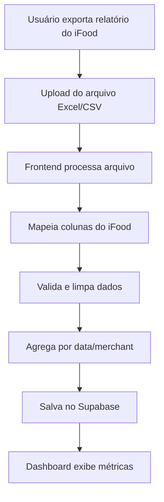

# 💰 Funcionalidades Financeiras do Sistema

## ⚠️ IMPORTANTE: Não são Endpoints do iFood!

O sistema **NÃO** possui endpoints da API do iFood para dados financeiros.
As funcionalidades financeiras são para **processar arquivos exportados** do iFood.

## 📊 O que Temos Implementado

### 1. 📁 Processamento de Arquivos Financeiros (Frontend)
**Localização**: `frontend/plano-certo-hub-insights/src/utils/processors/`

#### Arquivos de Processamento:
- `ifoodProcessor.ts` - Processador principal de dados iFood
- `ifoodAdvancedProcessor.ts` - Processamento avançado com validações
- `ifoodColumnMapper.ts` - Mapeamento de colunas do Excel/CSV
- `valueParser.ts` - Parse de valores monetários
- `aggregationUtils.ts` - Agregação de dados por data

#### Como Funciona:
1. **Importação**: Usuário faz upload de arquivo Excel/CSV do iFood
2. **Processamento**: Sistema mapeia colunas e extrai dados
3. **Validação**: Remove cancelamentos e pedidos inválidos
4. **Agregação**: Agrupa dados por data/merchant
5. **Armazenamento**: Salva no banco Supabase

### 2. 📈 Tipos de Dados Financeiros Processados
**Localização**: `frontend/plano-certo-hub-insights/src/utils/types/financialData.ts`

#### Dados Agregados (`ProcessedFinancialData`):
- `revenue` - Receita total
- `orders_count` - Quantidade de pedidos
- `average_ticket` - Ticket médio
- `delivery_fee` - Taxa de entrega
- `commission` - Comissão do iFood
- `net_revenue` - Receita líquida

#### Dados Detalhados (`DetailedIfoodData`):
- Informações completas de cada pedido
- Valores de itens, taxas e comissões
- Datas de pedido, conclusão e pagamento
- Promoções e descontos aplicados
- Tempo de entrega

### 3. 🪝 Hooks para Métricas Financeiras
**Localização**: `frontend/plano-certo-hub-insights/src/hooks/`

#### `useFinancialMetrics.ts`:
```typescript
// Buscar métricas financeiras
const { data } = useFinancialMetrics(clientId, dateRange);

// Salvar novas métricas
const mutation = useCreateFinancialMetrics();
```

### 4. 💾 Banco de Dados (Supabase)

#### Tabelas Financeiras:
- `financial_metrics` - Métricas agregadas por dia/merchant
- `detailed_financial_data` - Dados detalhados de cada transação

#### Estrutura da Tabela `financial_metrics`:
```sql
CREATE TABLE financial_metrics (
    id UUID PRIMARY KEY,
    client_id VARCHAR,
    date DATE,
    revenue DECIMAL,
    orders_count INTEGER,
    average_ticket DECIMAL,
    delivery_fee DECIMAL,
    commission DECIMAL,
    net_revenue DECIMAL,
    source VARCHAR,
    created_at TIMESTAMP,
    updated_at TIMESTAMP
);
```

## 🔄 Fluxo de Processamento Financeiro



## 📝 Campos Mapeados do iFood

O sistema reconhece automaticamente estas colunas do relatório iFood:
- `DATA_DO_PEDIDO_OCORRENCIA` - Data do pedido
- `N°_PEDIDO` - Número do pedido
- `TIPO_DE_FATURAMENTO` - Tipo (venda/cancelamento)
- `VALOR_DOS_ITENS` - Valor dos produtos
- `TAXA_DE_ENTREGA_AO_CLIENTE` - Taxa de entrega
- `COMISSÃO_IFOOD` - Comissão cobrada
- `VALOR_LIQUIDO` - Valor final recebido

## ❌ O que NÃO temos

### Não há integração direta com API financeira do iFood:
- ❌ Endpoint `/financial/transactions`
- ❌ Endpoint `/financial/settlements`
- ❌ Endpoint `/financial/invoices`
- ❌ Webhook de pagamentos
- ❌ API de conciliação financeira

### Por quê?
O iFood **não disponibiliza** APIs públicas para dados financeiros detalhados.
A única forma de obter esses dados é através de:
1. **Portal do Parceiro** - Download manual de relatórios
2. **Email** - Relatórios enviados periodicamente
3. **SFTP** - Para parceiros enterprise (não é nosso caso)

## 💡 Como Usar as Funcionalidades Financeiras

### 1. Exportar Relatório do iFood:
1. Acessar Portal do Parceiro iFood
2. Ir em Relatórios → Financeiro
3. Selecionar período desejado
4. Exportar como Excel ou CSV

### 2. Importar no Sistema:
1. Acessar o Dashboard
2. Clicar em "Importar Dados Financeiros"
3. Selecionar arquivo exportado
4. Sistema processa automaticamente

### 3. Visualizar Métricas:
- Dashboard com gráficos de receita
- Tabelas com detalhamento por dia
- Comparativos entre períodos
- Export para Excel

## 🚀 Possíveis Melhorias Futuras

1. **Automação de Import**:
   - Integração com email para capturar relatórios automaticamente
   - OCR para processar PDFs de faturas

2. **Análises Avançadas**:
   - Previsão de receita
   - Análise de sazonalidade
   - Comparação com metas

3. **Integração Contábil**:
   - Export para sistemas contábeis
   - Geração de relatórios fiscais

## 📌 Observações Importantes

1. **Dados sempre defasados**: Como dependem de export manual, os dados financeiros nunca são em tempo real
2. **Validação necessária**: Sempre conferir com o Portal do iFood
3. **Backup recomendado**: Manter cópias dos arquivos originais
4. **Período de retenção**: iFood disponibiliza apenas últimos 90 dias