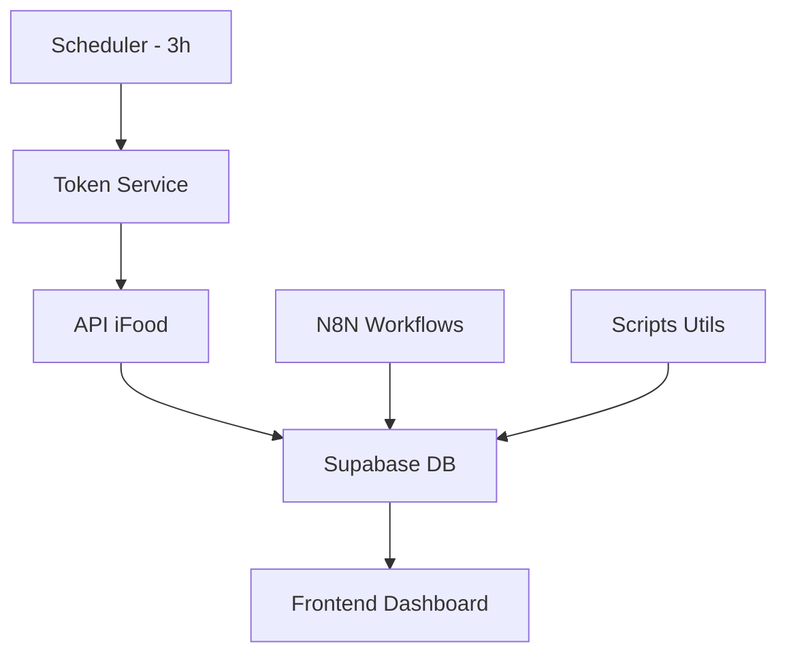

# 📁 Estrutura do Projeto - iFood Integration Hub

## 🎯 **ESTRUTURA REORGANIZADA**

```
📁 Nova pasta (2)/
├── 📁 services/                    # SERVIÇOS PRINCIPAIS
│   ├── 📁 ifood-token-service/     # ⭐ RENOVAÇÃO DE TOKENS (CORE)
│   └── 📁 python_services/         # Serviços Python
├── 📁 frontend/                    # INTERFACE WEB
│   └── 📁 plano-certo-hub-insights/ # Dashboard React
├── 📁 n8n-workflows/              # AUTOMAÇÃO N8N
├── 📁 scripts-utils/              # SCRIPTS UTILITÁRIOS
├── 📁 documentation/              # DOCUMENTAÇÃO
├── 📁 setup/                      # ✅ SCRIPTS DE INSTALAÇÃO
├── 📁 tests/                      # ✅ SCRIPTS DE TESTE
├── 📁 logs/                       # ✅ ARQUIVOS DE LOG
├── 📁 temp/                       # ✅ ARQUIVOS TEMPORÁRIOS
└── 📁 exports/                    # EXPORTAÇÕES
```

## 🚀 **COMPONENTES PRINCIPAIS**

### **1. RENOVAÇÃO DE TOKENS (ATIVO 24/7)**
```
📁 services/ifood-token-service/
├── src/ifoodTokenService.ts       # ⭐ SERVIÇO PRINCIPAL
├── src/tokenScheduler.ts          # ⏰ SCHEDULER (3 em 3 horas)
└── src/tokenRefreshService.ts     # Serviço alternativo
```

### **2. FRONTEND DASHBOARD**
```
📁 frontend/plano-certo-hub-insights/
├── src/components/                # Componentes React
├── src/hooks/                     # Hooks customizados
└── supabase/migrations/           # Migrações banco
```

### **3. AUTOMAÇÃO N8N**
```
📁 n8n-workflows/
├── [CREATE] Token de Acesso.json
├── [UPDATE] Atualiza o Token de Acesso.json
├── [MERCHANT] *.json
└── [PRODUCT] *.json
```

## 🗂️ **ARQUIVOS ORGANIZADOS**

### **✅ Setup e Instalação** 
```
📁 setup/
├── install.bat                   # Instalação principal
├── python_installer.exe          # Instalador Python
├── setup_python.ps1             # Setup PowerShell
└── cleanup.bat                   # Limpeza
```

### **✅ Testes**
```
📁 tests/
├── test_token_*.py               # Testes de token
├── test_ifood_webhook.py         # Teste webhook
└── check_table_structure.py     # Verificação DB
```

### **✅ Logs**
```
📁 logs/
└── ifood_sync.log               # Log de sincronização
```

## 🎯 **FLUXO DE FUNCIONAMENTO**



## 🔧 **COMANDOS PRINCIPAIS**

### **Renovação de Tokens:**
```bash
# Verificar status
node scripts-utils/monitor-token-updates.js --stats-only

# Forçar renovação
node scripts-utils/test-expiration-check.js

# Monitorar em tempo real
node scripts-utils/monitor-token-updates.js
```

### **Frontend:**
```bash
cd frontend/plano-certo-hub-insights
npm run dev
```

### **Setup Inicial:**
```bash
# Windows
setup/install.bat

# PowerShell
setup/setup_python.ps1
```

## ⚠️ **IMPORTANTE**

- ✅ **Tokens renovam automaticamente a cada 3 horas**
- ✅ **Frontend acessível via navegador**
- ✅ **N8N workflows funcionando**
- ✅ **Scripts organizados por função**
- ✅ **Logs centralizados**

## 📋 **ARQUIVOS PRINCIPAIS NA RAIZ**

- `README.md` - Documentação principal
- `main.py` - Script Python principal
- `ifood_api_client.py` - Cliente API iFood
- `config.py` - Configurações
- `requirements.txt` - Dependências Python
- `supabase_client.py` - Cliente Supabase

---

**🎉 Projeto organizado e funcional!**