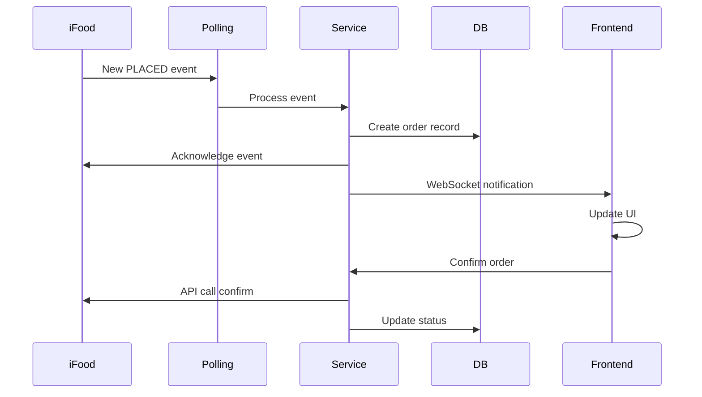
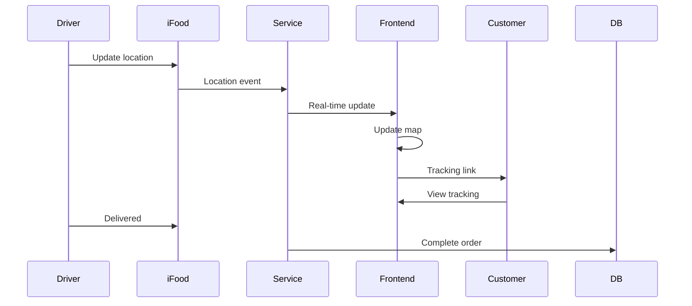

# 📦 Documentação Detalhada dos Módulos

## Frontend Modules

### 1. IfoodOrdersManager
**Localização**: `frontend/plano-certo-hub-insights/src/components/modules/IfoodOrdersManager.tsx`

#### Funcionalidades Principais
- **Polling Automático**: Sincronização a cada 30 segundos com o iFood
- **Gestão do Ciclo de Pedidos**:
  - `PENDING` → Confirmar pedido
  - `CONFIRMED` → Iniciar preparação automática
  - `PREPARING` → Marcar como pronto
  - `READY_FOR_PICKUP` → Despachar para entrega
  - `DISPATCHED` → Confirmar entrega
  - `DELIVERED` → Pedido concluído

#### Estados e Dados
```typescript
interface OrderState {
  orders: IFoodOrder[]           // Pedidos ativos
  completedOrders: IFoodOrder[]  // Histórico de pedidos
  isLoading: boolean              // Estado de carregamento
  pollingActive: boolean          // Status do polling
  lastPollTime: Date             // Última sincronização
}
```

#### Ações Disponíveis
- **Confirmar Pedido**: Aceita e inicia preparação
- **Cancelar Pedido**: Com motivo obrigatório
- **Atualizar Status**: Progresso no ciclo
- **Ver Detalhes**: Modal com informações completas
- **Navegar para Entrega**: Link direto para tracking

---

### 2. IfoodShippingManager
**Localização**: `frontend/plano-certo-hub-insights/src/components/modules/IfoodShippingManager.tsx`

#### Funcionalidades Principais
- **Rastreamento em Tempo Real**: Localização GPS do entregador
- **Gestão de Mudança de Endereço**:
  - Timeout de 15 minutos
  - Cálculo de taxa adicional
  - Aceitar/Rejeitar com motivo

#### Integrações
- **ShippingMap Component**: Visualização no mapa
- **Safe Delivery**: Score de risco (0-100)
- **Driver Info**: Nome, telefone, veículo

#### Estrutura de Dados
```typescript
interface ShippingData {
  orderId: string
  driver: {
    name: string
    phone: string
    vehicleType: string
    location: { lat: number, lng: number }
  }
  estimatedDelivery: Date
  safeDeliveryScore: number
  addressChange?: {
    newAddress: string
    additionalFee: number
    deadline: Date
  }
}
```

---

### 3. IfoodReviewsManager
**Localização**: `frontend/plano-certo-hub-insights/src/components/modules/IfoodReviewsManager.tsx`

#### Funcionalidades
- **Sincronização de Avaliações**: Import automático do iFood
- **Sistema de Resposta**:
  - Templates de resposta
  - Personalização por nota
  - Histórico de respostas

#### Métricas e Analytics
```typescript
interface ReviewMetrics {
  averageScore: number          // Média geral
  totalReviews: number          // Total de avaliações
  responseRate: number          // % de respostas
  sentimentDistribution: {
    positive: number
    neutral: number
    negative: number
  }
}
```

#### Filtros Disponíveis
- Por período (hoje, semana, mês)
- Por nota (1-5 estrelas)
- Por status (respondido/pendente)
- Por sentimento (positivo/negativo)

---

### 4. IfoodApiConfig
**Localização**: `frontend/plano-certo-hub-insights/src/components/modules/IfoodApiConfig.tsx`

#### Configurações Gerenciadas
- **Credenciais OAuth2**:
  - Client ID
  - Client Secret
  - Merchant ID
  
- **Ambientes**:
  - Sandbox (testes)
  - Production (produção)

#### Funcionalidades
- **Test Connection**: Valida credenciais
- **Token Status**: Mostra validade do token
- **Auto Refresh**: Renovação automática
- **Health Check**: Status da integração

---

### 5. ShippingMap
**Localização**: `frontend/plano-certo-hub-insights/src/components/modules/ShippingMap.tsx`

#### Visualizações
- **Mapa Interativo**: Leaflet/Mapbox
- **Heatmap de Vendas**: Densidade por região
- **Rotas de Entrega**: Trajeto do entregador
- **Markers Customizados**:
  - Restaurante (origem)
  - Cliente (destino)
  - Entregador (tempo real)

#### Analytics Geográfico
```typescript
interface GeoAnalytics {
  hotspots: Array<{
    location: [lat, lng]
    intensity: number
  }>
  topRegions: Array<{
    name: string
    orderCount: number
    revenue: number
  }>
  deliveryZones: Array<{
    polygon: Coordinates[]
    avgDeliveryTime: number
    demandLevel: 'low' | 'medium' | 'high'
  }>
}
```

---

## Backend Services

### 1. IFoodPollingService
**Localização**: `services/ifood-token-service/src/ifoodPollingService.ts`

#### Características Técnicas
- **Polling Precision**: 30s ± 100ms
- **Drift Correction**: Auto-ajuste de timing
- **Event Deduplication**: Prevenção de duplicatas
- **Connection Pooling**: Otimização de recursos

#### Cache Strategy
```typescript
const cacheConfig = {
  token: { ttl: 5 * 60 * 1000 },      // 5 minutos
  merchant: { ttl: 10 * 60 * 1000 },  // 10 minutos
  orders: { ttl: 30 * 1000 }          // 30 segundos
}
```

#### Event Processing
1. **Fetch Events**: GET /events:polling
2. **Process Each Event**:
   - PLACED → Create order
   - STATUS_CHANGED → Update status
   - CANCELLED → Mark cancelled
3. **Acknowledge**: POST /events/acknowledgment
4. **Store in DB**: Log all events

---

### 2. IFoodOrderService
**Localização**: `services/ifood-token-service/src/ifoodOrderService.ts`

#### Operações Principais
```typescript
class IFoodOrderService {
  // Criação e importação
  async createOrderFromEvent(event: PlacedEvent)
  async fetchOrderDetails(orderId: string)
  async processVirtualBag(orderId: string)
  
  // Gestão de status
  async confirmOrder(orderId: string)
  async startPreparation(orderId: string)
  async markReadyForPickup(orderId: string)
  async dispatchOrder(orderId: string)
  async deliverOrder(orderId: string)
  
  // Cancelamento
  async cancelOrder(orderId: string, reason: CancelReason)
  
  // Analytics
  async getOrderStatistics(merchantId: string, period: DateRange)
  async calculateMetrics(orders: Order[])
}
```

#### Validações
- Merchant ownership
- Status transitions
- Token validity
- Data integrity

---

### 3. Server (API Principal)
**Localização**: `services/ifood-token-service/src/server.ts`

#### Endpoints Documentados

##### Orders
```typescript
// Listar pedidos
GET /api/orders
Query: { merchantId, status?, date? }
Response: Order[]

// Detalhes do pedido
GET /api/orders/:orderId
Response: OrderDetails

// Atualizar status
PUT /api/orders/:orderId/status
Body: { status: OrderStatus, reason?: string }
Response: { success: boolean }

// Confirmar pedido
POST /api/orders/:orderId/confirm
Response: { success: boolean }

// Cancelar pedido
POST /api/orders/:orderId/cancel
Body: { reason: CancelReason }
Response: { success: boolean }
```

##### Polling
```typescript
// Iniciar polling
POST /api/polling/start
Body: { merchantId: string }
Response: { status: 'started' }

// Parar polling
POST /api/polling/stop
Body: { merchantId: string }
Response: { status: 'stopped' }

// Status do polling
GET /api/polling/status
Response: { 
  active: boolean,
  lastPoll: Date,
  eventsProcessed: number
}
```

##### Reviews
```typescript
// Listar avaliações
GET /api/reviews
Query: { merchantId, rating?, period? }
Response: Review[]

// Responder avaliação
POST /api/reviews/:reviewId/reply
Body: { message: string }
Response: { success: boolean }

// Métricas de avaliações
GET /api/reviews/metrics
Response: ReviewMetrics
```

##### Shipping
```typescript
// Status da entrega
GET /api/shipping/:orderId
Response: ShippingStatus

// Aceitar mudança de endereço
POST /api/shipping/:orderId/address-change/accept
Body: { additionalFee: number }
Response: { success: boolean }

// Rejeitar mudança
POST /api/shipping/:orderId/address-change/reject
Body: { reason: string }
Response: { success: boolean }

// Tracking público
GET /api/tracking/:trackingCode
Response: PublicTrackingInfo
```

---

## Database Schema

### Orders Tables
```sql
-- Tabela principal de pedidos
CREATE TABLE ifood_orders (
  id UUID PRIMARY KEY,
  order_id VARCHAR(255) UNIQUE,
  merchant_id VARCHAR(255),
  status VARCHAR(50),
  customer_name VARCHAR(255),
  customer_phone VARCHAR(50),
  delivery_address TEXT,
  total_value DECIMAL(10,2),
  delivery_fee DECIMAL(10,2),
  payment_method VARCHAR(50),
  items JSONB,
  created_at TIMESTAMP,
  updated_at TIMESTAMP
);

-- Log de eventos
CREATE TABLE ifood_events (
  id UUID PRIMARY KEY,
  event_id VARCHAR(255) UNIQUE,
  event_type VARCHAR(50),
  order_id VARCHAR(255),
  merchant_id VARCHAR(255),
  payload JSONB,
  acknowledged BOOLEAN DEFAULT false,
  created_at TIMESTAMP
);
```

### Shipping Tables
```sql
-- Status de entrega
CREATE TABLE ifood_shipping_status (
  id UUID PRIMARY KEY,
  order_id VARCHAR(255) REFERENCES ifood_orders(order_id),
  driver_name VARCHAR(255),
  driver_phone VARCHAR(50),
  vehicle_type VARCHAR(50),
  current_location JSONB, -- {lat, lng}
  estimated_delivery TIMESTAMP,
  safe_delivery_score INTEGER,
  tracking_url TEXT,
  updated_at TIMESTAMP
);

-- Mudanças de endereço
CREATE TABLE ifood_address_changes (
  id UUID PRIMARY KEY,
  order_id VARCHAR(255),
  original_address TEXT,
  new_address TEXT,
  additional_fee DECIMAL(10,2),
  deadline TIMESTAMP,
  status VARCHAR(50), -- pending/accepted/rejected
  reason TEXT,
  created_at TIMESTAMP
);
```

### Reviews Tables
```sql
-- Avaliações
CREATE TABLE ifood_reviews (
  id UUID PRIMARY KEY,
  review_id VARCHAR(255) UNIQUE,
  order_id VARCHAR(255),
  merchant_id VARCHAR(255),
  customer_name VARCHAR(255),
  rating INTEGER CHECK (rating >= 1 AND rating <= 5),
  comment TEXT,
  sentiment VARCHAR(20), -- positive/neutral/negative
  created_at TIMESTAMP
);

-- Respostas às avaliações
CREATE TABLE ifood_review_replies (
  id UUID PRIMARY KEY,
  review_id VARCHAR(255) REFERENCES ifood_reviews(review_id),
  reply_text TEXT,
  replied_by VARCHAR(255),
  replied_at TIMESTAMP
);
```

---

## Fluxos de Integração

### Fluxo de Novo Pedido


### Fluxo de Entrega


---

## Configurações e Variáveis

### Environment Variables
```bash
# Token Service
IFOOD_CLIENT_ID=xxx
IFOOD_CLIENT_SECRET=xxx
IFOOD_MERCHANT_ID=xxx
SUPABASE_URL=xxx
SUPABASE_SERVICE_KEY=xxx
POLLING_INTERVAL=30000
TOKEN_CACHE_TTL=300000

# Frontend
VITE_API_URL=http://localhost:8081
VITE_SUPABASE_URL=xxx
VITE_SUPABASE_ANON_KEY=xxx
VITE_MAPBOX_TOKEN=xxx
```

### Performance Tuning
```typescript
// Polling optimization
const pollingConfig = {
  interval: 30000,        // 30 seconds
  maxRetries: 3,
  retryDelay: 5000,
  batchSize: 100,         // Events per request
  connectionPool: 10      // Max concurrent connections
}

// Cache configuration
const cacheSettings = {
  redis: {
    host: 'localhost',
    port: 6379,
    ttl: 300
  },
  memory: {
    max: 100,             // Max items in memory
    ttl: 60              // Seconds
  }
}
```

---

## Monitoramento e Logs

### Métricas Importantes
- **Polling Success Rate**: >99.5%
- **Event Processing Time**: <500ms
- **API Response Time**: <200ms
- **Cache Hit Rate**: >80%
- **Order Completion Rate**: >95%

### Logs Structure
```typescript
interface LogEntry {
  timestamp: Date
  level: 'info' | 'warn' | 'error'
  module: string
  action: string
  data: any
  duration?: number
  error?: Error
}
```

### Monitoring Queries
```sql
-- Polling health
SELECT 
  DATE_TRUNC('hour', created_at) as hour,
  COUNT(*) as polls,
  AVG(events_count) as avg_events,
  MAX(duration_ms) as max_duration
FROM ifood_polling_log
WHERE created_at > NOW() - INTERVAL '24 hours'
GROUP BY hour
ORDER BY hour DESC;

-- Order status distribution
SELECT 
  status,
  COUNT(*) as count,
  AVG(EXTRACT(EPOCH FROM (updated_at - created_at))/60) as avg_minutes
FROM ifood_orders
WHERE created_at > NOW() - INTERVAL '7 days'
GROUP BY status;
```