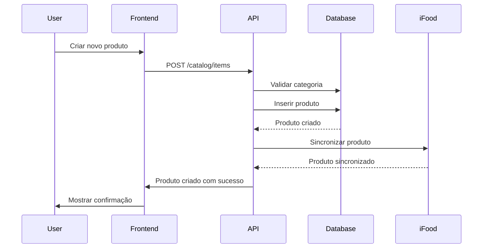
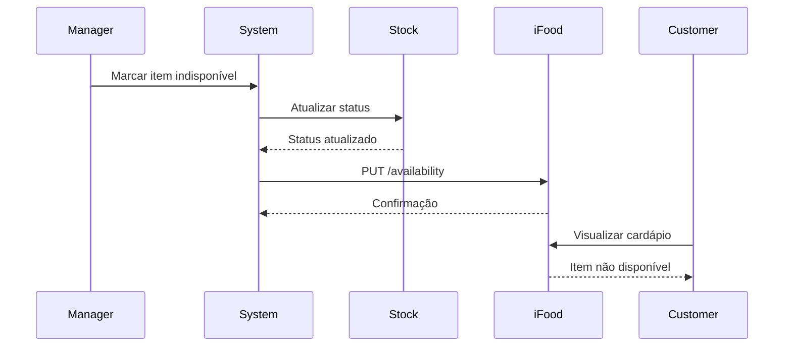

# 📚 Catalog Module

## Visão Geral

O módulo **Catalog** gerencia todo o cardápio e produtos do estabelecimento no iFood, incluindo categorias, itens, modificadores, complementos, preços e disponibilidade. É o coração do sistema de vendas, definindo o que pode ser vendido e como.

## Arquitetura do Módulo

```
┌──────────────────────────────────────────────────────────────┐
│                       Catalog Module                         │
├──────────────────────────────────────────────────────────────┤
│                                                              │
│  ┌────────────┐  ┌────────────┐  ┌────────────┐            │
│  │ Categories │  │   Items    │  │  Modifiers │            │
│  │  Manager   │  │  Manager   │  │   Manager  │            │
│  └────────────┘  └────────────┘  └────────────┘            │
│                                                              │
│  ┌────────────┐  ┌────────────┐  ┌────────────┐            │
│  │   Pricing  │  │Availability│  │   Images   │            │
│  │   Engine   │  │  Control   │  │   Manager  │            │
│  └────────────┘  └────────────┘  └────────────┘            │
│                                                              │
│  ┌─────────────────────────────────────────────┐            │
│  │           Synchronization Service            │            │
│  │         (iFood Catalog API Integration)      │            │
│  └─────────────────────────────────────────────┘            │
│                                                              │
└──────────────────────────────────────────────────────────────┘
```

## Componentes Principais

### 1. Menu Management
**Localização**: `frontend/src/components/modules/MenuManagement.tsx`

#### Estrutura Hierárquica
```typescript
interface Menu {
  id: string
  merchantId: string
  name: string
  description?: string
  categories: Category[]
  active: boolean
  availableFrom?: Date
  availableTo?: Date
  schedules?: MenuSchedule[]
}

interface Category {
  id: string
  name: string
  description?: string
  imageUrl?: string
  sortOrder: number
  items: Item[]
  availability: AvailabilityConfig
  template?: CategoryTemplate
}

interface Item {
  id: string
  externalId?: string  // ID no sistema do merchant
  name: string
  description: string
  imageUrl?: string
  price: Price
  nutritionalInfo?: NutritionalInfo
  modifierGroups?: ModifierGroup[]
  tags?: Tag[]
  availability: AvailabilityConfig
  preparationTime?: number  // minutos
  serves?: number  // quantas pessoas
  packageInfo?: PackageInfo
}
```

### 2. Product Management
**Localização**: `services/ifood-token-service/src/catalogService.ts`

#### Estrutura de Produtos
```typescript
interface Product {
  // Identificação
  id: string
  sku: string
  barcode?: string
  
  // Informações básicas
  name: string
  description: string
  shortDescription?: string
  
  // Categorização
  categoryId: string
  subcategoryId?: string
  brand?: string
  
  // Mídia
  images: ProductImage[]
  videos?: ProductVideo[]
  
  // Características
  weight?: number  // gramas
  dimensions?: Dimensions
  allergens?: Allergen[]
  dietary?: DietaryInfo[]
  
  // Status
  status: 'ACTIVE' | 'INACTIVE' | 'OUT_OF_STOCK'
  visibility: 'PUBLIC' | 'PRIVATE' | 'SCHEDULED'
}

interface ProductImage {
  id: string
  url: string
  type: 'MAIN' | 'GALLERY' | 'THUMBNAIL'
  alt?: string
  sortOrder: number
}
```

### 3. Pricing System
**Localização**: `services/ifood-token-service/src/pricingService.ts`

#### Estrutura de Preços
```typescript
interface Price {
  value: number
  originalValue?: number  // Preço antes do desconto
  currency: 'BRL'
}

interface PricingRule {
  id: string
  name: string
  type: 'FIXED' | 'PERCENTAGE' | 'PROGRESSIVE'
  conditions: PricingCondition[]
  action: PricingAction
  priority: number
  active: boolean
}

interface PricingCondition {
  type: 'TIME' | 'QUANTITY' | 'CUSTOMER_TYPE' | 'LOCATION' | 'PAYMENT_METHOD'
  operator: 'EQUALS' | 'GREATER_THAN' | 'LESS_THAN' | 'BETWEEN' | 'IN'
  value: any
}

interface PricingAction {
  type: 'DISCOUNT' | 'INCREASE' | 'FIXED_PRICE'
  value: number
  maxDiscount?: number
}

interface DynamicPricing {
  itemId: string
  basePrice: number
  rules: PricingRule[]
  finalPrice: number
  appliedRules: string[]
}
```

### 4. Modifiers & Options
**Localização**: `frontend/src/components/modules/ModifierManager.tsx`

#### Sistema de Modificadores
```typescript
interface ModifierGroup {
  id: string
  name: string  // Ex: "Escolha o ponto da carne"
  min: number   // Mínimo de seleções
  max: number   // Máximo de seleções
  modifiers: Modifier[]
  required: boolean
}

interface Modifier {
  id: string
  name: string  // Ex: "Mal passado"
  price: number // Adicional no preço
  availability: AvailabilityConfig
  maxQuantity?: number
  nutritionalInfo?: NutritionalInfo
}

interface ComboItem {
  id: string
  name: string
  items: Item[]  // Itens que compõem o combo
  price: Price   // Preço do combo
  savings: number // Economia vs itens individuais
}

interface OptionGroup {
  id: string
  name: string  // Ex: "Adicione bebida"
  type: 'SINGLE' | 'MULTIPLE'
  options: Option[]
  displayType: 'RADIO' | 'CHECKBOX' | 'DROPDOWN'
}

interface Option {
  id: string
  name: string
  price: number
  selected: boolean
  imageUrl?: string
}
```

### 5. Availability Control
**Localização**: `services/ifood-token-service/src/availabilityService.ts`

#### Controle de Disponibilidade
```typescript
interface AvailabilityConfig {
  available: boolean
  schedule?: AvailabilitySchedule[]
  stock?: StockControl
  restrictions?: AvailabilityRestriction[]
}

interface AvailabilitySchedule {
  dayOfWeek: number[]  // 0-6
  startTime: string     // "10:00"
  endTime: string       // "22:00"
  timezone: string      // "America/Sao_Paulo"
}

interface StockControl {
  type: 'INFINITE' | 'LIMITED' | 'DAILY'
  quantity?: number
  currentStock?: number
  restockTime?: Date
  lowStockThreshold?: number
  autoDisableWhenOut: boolean
}

interface AvailabilityRestriction {
  type: 'LOCATION' | 'CUSTOMER_TYPE' | 'MINIMUM_ORDER' | 'MAXIMUM_ORDER'
  condition: any
  message?: string
}

class AvailabilityService {
  // Verificar disponibilidade em tempo real
  async checkAvailability(itemId: string, quantity: number): Promise<boolean>
  
  // Atualizar estoque
  async updateStock(itemId: string, quantity: number): Promise<void>
  
  // Desabilitar item temporariamente
  async disableItem(itemId: string, reason: string, duration?: number): Promise<void>
  
  // Habilitar item
  async enableItem(itemId: string): Promise<void>
  
  // Verificar disponibilidade em massa
  async bulkCheckAvailability(items: Array<{id: string, quantity: number}>): Promise<Map<string, boolean>>
}
```

### 6. Catalog Synchronization
**Localização**: `services/ifood-token-service/src/catalogSyncService.ts`

#### Sincronização com iFood
```typescript
interface CatalogSync {
  merchantId: string
  lastSync: Date
  status: 'SYNCED' | 'PENDING' | 'ERROR' | 'IN_PROGRESS'
  changes: CatalogChange[]
}

interface CatalogChange {
  id: string
  type: 'CREATE' | 'UPDATE' | 'DELETE'
  entity: 'CATEGORY' | 'ITEM' | 'MODIFIER' | 'PRICE'
  entityId: string
  oldValue?: any
  newValue?: any
  timestamp: Date
  synced: boolean
  error?: string
}

class CatalogSyncService {
  // Sincronizar catálogo completo
  async fullSync(merchantId: string): Promise<SyncResult>
  
  // Sincronização incremental
  async incrementalSync(merchantId: string, changes: CatalogChange[]): Promise<SyncResult>
  
  // Validar catálogo antes de sincronizar
  async validateCatalog(catalog: Menu): Promise<ValidationResult>
  
  // Obter status de sincronização
  async getSyncStatus(merchantId: string): Promise<CatalogSync>
  
  // Reverter sincronização
  async rollbackSync(merchantId: string, syncId: string): Promise<void>
}
```

## API Endpoints

### Category Management
```typescript
// Listar categorias
GET /api/catalog/categories
Query: { merchantId, active? }
Response: Category[]

// Criar categoria
POST /api/catalog/categories
Body: Category
Response: Category

// Atualizar categoria
PUT /api/catalog/categories/:categoryId
Body: Partial<Category>
Response: Category

// Deletar categoria
DELETE /api/catalog/categories/:categoryId
Response: { success: boolean }

// Reordenar categorias
PUT /api/catalog/categories/reorder
Body: { categoryIds: string[] }
Response: { success: boolean }
```

### Item Management
```typescript
// Listar itens
GET /api/catalog/items
Query: { merchantId, categoryId?, search?, page?, limit? }
Response: { items: Item[], total: number }

// Criar item
POST /api/catalog/items
Body: Item
Response: Item

// Atualizar item
PUT /api/catalog/items/:itemId
Body: Partial<Item>
Response: Item

// Deletar item
DELETE /api/catalog/items/:itemId
Response: { success: boolean }

// Upload de imagem
POST /api/catalog/items/:itemId/image
Body: FormData
Response: { imageUrl: string }

// Clonar item
POST /api/catalog/items/:itemId/clone
Body: { name: string, categoryId?: string }
Response: Item
```

### Modifier Management
```typescript
// Listar grupos de modificadores
GET /api/catalog/modifier-groups
Query: { merchantId }
Response: ModifierGroup[]

// Criar grupo de modificadores
POST /api/catalog/modifier-groups
Body: ModifierGroup
Response: ModifierGroup

// Associar modificadores a item
POST /api/catalog/items/:itemId/modifiers
Body: { modifierGroupIds: string[] }
Response: { success: boolean }
```

### Availability Management
```typescript
// Verificar disponibilidade
GET /api/catalog/items/:itemId/availability
Response: AvailabilityConfig

// Atualizar disponibilidade
PUT /api/catalog/items/:itemId/availability
Body: AvailabilityConfig
Response: { success: boolean }

// Disponibilidade em massa
POST /api/catalog/availability/bulk
Body: { itemIds: string[], available: boolean }
Response: { updated: number }

// Atualizar estoque
PUT /api/catalog/items/:itemId/stock
Body: { quantity: number, operation: 'SET' | 'ADD' | 'SUBTRACT' }
Response: { currentStock: number }
```

### Pricing Management
```typescript
// Obter preço atual
GET /api/catalog/items/:itemId/price
Query: { includeRules? }
Response: { price: Price, appliedRules?: PricingRule[] }

// Atualizar preço
PUT /api/catalog/items/:itemId/price
Body: Price
Response: Price

// Criar regra de preço
POST /api/catalog/pricing-rules
Body: PricingRule
Response: PricingRule

// Aplicar promoção
POST /api/catalog/promotions
Body: { itemIds: string[], discount: number, validUntil: Date }
Response: { promotionId: string }
```

### Synchronization
```typescript
// Sincronizar com iFood
POST /api/catalog/sync
Body: { merchantId: string, type: 'FULL' | 'INCREMENTAL' }
Response: { syncId: string, status: string }

// Status da sincronização
GET /api/catalog/sync/:syncId
Response: CatalogSync

// Validar catálogo
POST /api/catalog/validate
Body: { merchantId: string }
Response: { valid: boolean, errors?: ValidationError[] }
```

## Integração com iFood API

### Endpoints iFood Utilizados
```http
# Catálogo completo
GET https://merchant-api.ifood.com.br/catalog/v2.0/merchants/{merchantId}/catalog

# Categorias
POST/PUT/DELETE https://merchant-api.ifood.com.br/catalog/v2.0/merchants/{merchantId}/categories

# Produtos
POST/PUT/DELETE https://merchant-api.ifood.com.br/catalog/v2.0/merchants/{merchantId}/products

# Modificadores
POST/PUT/DELETE https://merchant-api.ifood.com.br/catalog/v2.0/merchants/{merchantId}/option-groups

# Disponibilidade
PUT https://merchant-api.ifood.com.br/catalog/v2.0/merchants/{merchantId}/products/{productId}/availability

# Preços
PUT https://merchant-api.ifood.com.br/catalog/v2.0/merchants/{merchantId}/products/{productId}/price
```

## Database Schema

### Tabelas Principais
```sql
-- Categorias
CREATE TABLE catalog_categories (
  id UUID PRIMARY KEY DEFAULT gen_random_uuid(),
  merchant_id VARCHAR(255) NOT NULL,
  external_id VARCHAR(255),
  name VARCHAR(255) NOT NULL,
  description TEXT,
  image_url TEXT,
  sort_order INTEGER DEFAULT 0,
  active BOOLEAN DEFAULT true,
  template VARCHAR(50),
  created_at TIMESTAMP DEFAULT NOW(),
  updated_at TIMESTAMP DEFAULT NOW(),
  UNIQUE(merchant_id, external_id)
);

-- Produtos/Itens
CREATE TABLE catalog_items (
  id UUID PRIMARY KEY DEFAULT gen_random_uuid(),
  merchant_id VARCHAR(255) NOT NULL,
  category_id UUID REFERENCES catalog_categories(id),
  external_id VARCHAR(255),
  sku VARCHAR(100),
  name VARCHAR(255) NOT NULL,
  description TEXT,
  short_description VARCHAR(500),
  image_url TEXT,
  price DECIMAL(10,2) NOT NULL,
  original_price DECIMAL(10,2),
  preparation_time INTEGER,
  serves INTEGER,
  status VARCHAR(50) DEFAULT 'ACTIVE',
  nutritional_info JSONB,
  tags TEXT[],
  created_at TIMESTAMP DEFAULT NOW(),
  updated_at TIMESTAMP DEFAULT NOW(),
  UNIQUE(merchant_id, external_id)
);

-- Grupos de Modificadores
CREATE TABLE catalog_modifier_groups (
  id UUID PRIMARY KEY DEFAULT gen_random_uuid(),
  merchant_id VARCHAR(255) NOT NULL,
  name VARCHAR(255) NOT NULL,
  min_selections INTEGER DEFAULT 0,
  max_selections INTEGER DEFAULT 1,
  required BOOLEAN DEFAULT false,
  created_at TIMESTAMP DEFAULT NOW()
);

-- Modificadores
CREATE TABLE catalog_modifiers (
  id UUID PRIMARY KEY DEFAULT gen_random_uuid(),
  group_id UUID REFERENCES catalog_modifier_groups(id),
  name VARCHAR(255) NOT NULL,
  price DECIMAL(10,2) DEFAULT 0,
  max_quantity INTEGER,
  available BOOLEAN DEFAULT true,
  created_at TIMESTAMP DEFAULT NOW()
);

-- Relação Item-Modificadores
CREATE TABLE item_modifier_groups (
  item_id UUID REFERENCES catalog_items(id),
  modifier_group_id UUID REFERENCES catalog_modifier_groups(id),
  sort_order INTEGER DEFAULT 0,
  PRIMARY KEY (item_id, modifier_group_id)
);

-- Controle de Estoque
CREATE TABLE catalog_stock (
  id UUID PRIMARY KEY DEFAULT gen_random_uuid(),
  item_id UUID REFERENCES catalog_items(id) UNIQUE,
  type VARCHAR(50) DEFAULT 'INFINITE',
  quantity INTEGER,
  current_stock INTEGER,
  low_threshold INTEGER,
  auto_disable BOOLEAN DEFAULT true,
  last_restock TIMESTAMP,
  updated_at TIMESTAMP DEFAULT NOW()
);

-- Disponibilidade
CREATE TABLE catalog_availability (
  id UUID PRIMARY KEY DEFAULT gen_random_uuid(),
  item_id UUID REFERENCES catalog_items(id),
  available BOOLEAN DEFAULT true,
  schedule JSONB,
  restrictions JSONB,
  reason VARCHAR(255),
  disabled_until TIMESTAMP,
  created_at TIMESTAMP DEFAULT NOW()
);

-- Regras de Preço
CREATE TABLE catalog_pricing_rules (
  id UUID PRIMARY KEY DEFAULT gen_random_uuid(),
  merchant_id VARCHAR(255) NOT NULL,
  name VARCHAR(255) NOT NULL,
  type VARCHAR(50) NOT NULL,
  conditions JSONB NOT NULL,
  action JSONB NOT NULL,
  priority INTEGER DEFAULT 0,
  active BOOLEAN DEFAULT true,
  valid_from TIMESTAMP,
  valid_to TIMESTAMP,
  created_at TIMESTAMP DEFAULT NOW()
);

-- Log de Sincronização
CREATE TABLE catalog_sync_log (
  id UUID PRIMARY KEY DEFAULT gen_random_uuid(),
  merchant_id VARCHAR(255) NOT NULL,
  sync_type VARCHAR(50) NOT NULL,
  status VARCHAR(50) NOT NULL,
  changes_count INTEGER DEFAULT 0,
  errors JSONB,
  started_at TIMESTAMP DEFAULT NOW(),
  completed_at TIMESTAMP
);

-- Índices para performance
CREATE INDEX idx_categories_merchant ON catalog_categories(merchant_id, active);
CREATE INDEX idx_items_merchant_category ON catalog_items(merchant_id, category_id);
CREATE INDEX idx_items_sku ON catalog_items(sku);
CREATE INDEX idx_items_status ON catalog_items(status);
CREATE INDEX idx_stock_item ON catalog_stock(item_id);
CREATE INDEX idx_availability_item ON catalog_availability(item_id);
CREATE INDEX idx_sync_merchant ON catalog_sync_log(merchant_id, started_at DESC);
```

## Fluxos de Negócio

### 1. Criação de Produto


### 2. Atualização de Disponibilidade


## Funcionalidades Avançadas

### 1. Smart Pricing
```typescript
class SmartPricingEngine {
  // Preço dinâmico baseado em demanda
  calculateDynamicPrice(itemId: string, demand: number): Price
  
  // Sugestão de preço baseado em competidores
  suggestCompetitivePrice(itemId: string, marketData: MarketPrice[]): Price
  
  // Otimização de margem
  optimizeMargin(itemId: string, targetMargin: number): Price
  
  // Bundle pricing
  calculateBundlePrice(items: Item[]): Price
}
```

### 2. Menu Intelligence
```typescript
interface MenuAnalytics {
  // Itens mais vendidos
  topSellingItems: Item[]
  
  // Itens com melhor margem
  highMarginItems: Item[]
  
  // Itens pouco vendidos
  underperformingItems: Item[]
  
  // Sugestões de otimização
  optimizationSuggestions: Suggestion[]
  
  // Análise de complementaridade
  itemPairings: Array<{item1: Item, item2: Item, frequency: number}>
}
```

### 3. Inventory Prediction
```typescript
class InventoryPredictor {
  // Prever demanda futura
  predictDemand(itemId: string, days: number): number
  
  // Sugerir reposição
  suggestRestock(itemId: string): RestockSuggestion
  
  // Alertar sobre possível falta
  predictStockout(itemId: string): Date | null
}
```

## Melhores Práticas

### 1. Gestão de Catálogo
- Manter descrições claras e atrativas
- Usar imagens de alta qualidade (min 800x800)
- Categorizar produtos logicamente
- Atualizar disponibilidade em tempo real

### 2. Precificação
- Considerar custos e margem desejada
- Implementar promoções estratégicas
- Monitorar competidores
- Testar diferentes pontos de preço

### 3. Performance
- Cache de catálogo (5 min)
- Lazy loading de imagens
- Paginação em listagens grandes
- Índices otimizados no banco

### 4. Sincronização
- Sincronizar incrementalmente quando possível
- Validar antes de sincronizar
- Manter log de todas mudanças
- Implementar rollback em caso de erro

## Troubleshooting

### Problemas Comuns

| Problema | Causa | Solução |
|----------|-------|---------|
| Item não aparece no iFood | Sincronização falhou | Verificar catalog_sync_log |
| Preço incorreto | Regra de preço conflitante | Revisar catalog_pricing_rules |
| Estoque não atualiza | Cache desatualizado | Limpar cache e re-sincronizar |
| Imagem não carrega | URL inválida ou expirada | Re-upload da imagem |
| Categoria vazia | Itens inativos | Verificar status dos itens |

## Roadmap

### Implementado ✅
- CRUD de categorias e itens
- Sistema de modificadores
- Controle de disponibilidade
- Upload de imagens

### Em Desenvolvimento 🚧
- Sincronização automática com iFood
- Smart pricing engine
- Gestão avançada de estoque
- Menu analytics

### Planejado 📋
- AI para descrições de produtos
- Recomendação de combos
- Integração com sistemas de estoque
- A/B testing de cardápios