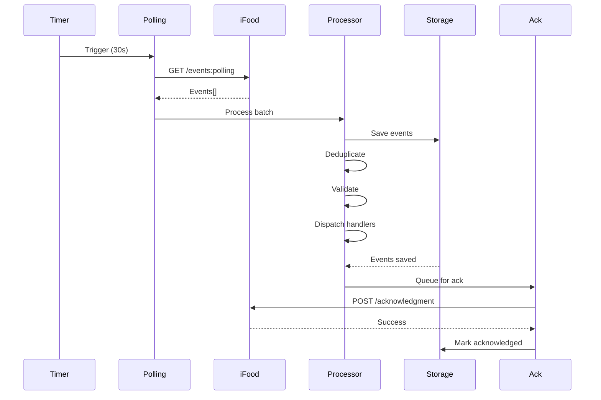
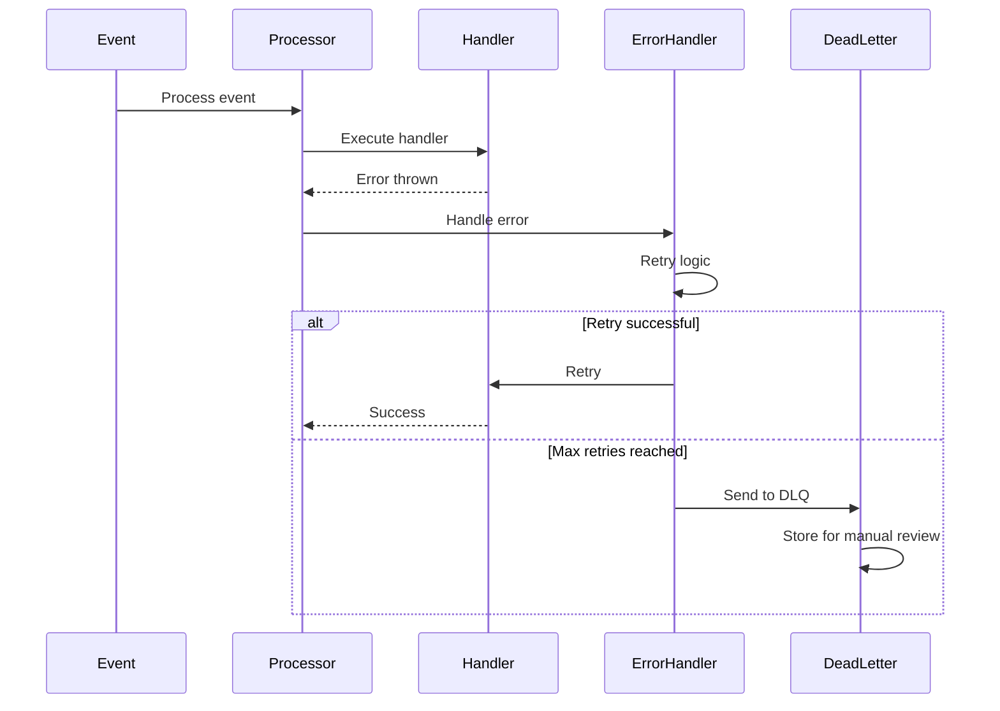

# 🔄 Events Module

## Visão Geral

O módulo **Events** é o sistema nervoso central da integração com o iFood, responsável por capturar, processar e sincronizar todos os eventos em tempo real. Utiliza polling de alta precisão para garantir que nenhum evento seja perdido e que o estado local esteja sempre sincronizado com o iFood.

## Arquitetura do Módulo

```
┌───────────────────────────────────────────────────────────────┐
│                        Events Module                          │
├───────────────────────────────────────────────────────────────┤
│                                                               │
│  ┌──────────────────────────────────────────────────────┐    │
│  │              Polling Engine (30s cycle)              │    │
│  │  ┌──────────┐  ┌──────────┐  ┌──────────┐          │    │
│  │  │  Fetcher │→ │Processor │→ │Acknowledger│         │    │
│  │  └──────────┘  └──────────┘  └──────────┘          │    │
│  └──────────────────────────────────────────────────────┘    │
│                                                               │
│  ┌──────────────────────────────────────────────────────┐    │
│  │                 Event Processing                      │    │
│  │  ┌────────────┐  ┌────────────┐  ┌────────────┐     │    │
│  │  │Deduplicator│  │ Validator  │  │ Dispatcher │     │    │
│  │  └────────────┘  └────────────┘  └────────────┘     │    │
│  └──────────────────────────────────────────────────────┘    │
│                                                               │
│  ┌──────────────────────────────────────────────────────┐    │
│  │                  Event Handlers                       │    │
│  │  ┌─────────┐ ┌─────────┐ ┌─────────┐ ┌─────────┐    │    │
│  │  │  Order  │ │Shipping │ │ Review  │ │Merchant │    │    │
│  │  │ Handler │ │ Handler │ │ Handler │ │ Handler │    │    │
│  │  └─────────┘ └─────────┘ └─────────┘ └─────────┘    │    │
│  └──────────────────────────────────────────────────────┘    │
│                                                               │
└───────────────────────────────────────────────────────────────┘
```

## Componentes Principais

### 1. Polling Engine
**Localização**: `services/ifood-token-service/src/ifoodPollingService.ts`

#### Características Técnicas
```typescript
class PollingEngine {
  private readonly POLLING_INTERVAL = 30000  // 30 segundos
  private readonly MAX_EVENTS_PER_POLL = 100
  private readonly DRIFT_CORRECTION_THRESHOLD = 100  // ms
  
  private isPolling: boolean = false
  private lastPollTime: Date
  private pollCount: number = 0
  private drift: number = 0
  
  // Iniciar polling
  async startPolling(merchantId: string): Promise<void>
  
  // Parar polling
  async stopPolling(merchantId: string): Promise<void>
  
  // Executar ciclo de polling
  private async pollCycle(): Promise<void>
  
  // Correção de drift para manter precisão
  private correctDrift(): void
  
  // Monitorar saúde do polling
  private healthCheck(): PollingHealth
}

interface PollingHealth {
  status: 'HEALTHY' | 'DEGRADED' | 'UNHEALTHY'
  uptime: number
  eventsProcessed: number
  errorRate: number
  averageLatency: number
  lastError?: Error
}
```

### 2. Event Types
**Localização**: `services/ifood-token-service/src/types/eventTypes.ts`

#### Tipos de Eventos Suportados
```typescript
enum EventType {
  // Order Events
  PLACED = 'PLACED',                    // Novo pedido recebido
  CONFIRMED = 'CONFIRMED',              // Pedido confirmado
  READY_FOR_PICKUP = 'READY_FOR_PICKUP', // Pronto para retirada
  DISPATCHED = 'DISPATCHED',            // Saiu para entrega
  DELIVERED = 'DELIVERED',              // Entregue
  CANCELLED = 'CANCELLED',              // Cancelado
  
  // Status Events
  STATUS_CHANGED = 'STATUS_CHANGED',    // Mudança de status genérica
  
  // Shipping Events
  DRIVER_ASSIGNED = 'DRIVER_ASSIGNED',  // Motorista designado
  DRIVER_ARRIVED = 'DRIVER_ARRIVED',    // Motorista chegou
  ADDRESS_CHANGED = 'ADDRESS_CHANGED',  // Endereço alterado
  
  // Review Events
  REVIEW_RECEIVED = 'REVIEW_RECEIVED',  // Nova avaliação
  REVIEW_REPLIED = 'REVIEW_REPLIED',    // Resposta enviada
  
  // Merchant Events
  MERCHANT_STATUS_CHANGED = 'MERCHANT_STATUS_CHANGED',
  INTERRUPTION_CREATED = 'INTERRUPTION_CREATED',
  INTERRUPTION_REMOVED = 'INTERRUPTION_REMOVED'
}

interface Event {
  id: string
  type: EventType
  merchantId: string
  orderId?: string
  createdAt: Date
  payload: any
  metadata?: EventMetadata
}

interface EventMetadata {
  source: 'IFOOD' | 'SYSTEM' | 'USER'
  version: string
  correlationId?: string
  causationId?: string
  userId?: string
  ipAddress?: string
}
```

### 3. Event Processing
**Localização**: `services/ifood-token-service/src/eventProcessor.ts`

#### Processamento de Eventos
```typescript
class EventProcessor {
  private handlers: Map<EventType, EventHandler[]>
  private queue: EventQueue
  private deduplicator: EventDeduplicator
  
  // Registrar handler para tipo de evento
  registerHandler(eventType: EventType, handler: EventHandler): void
  
  // Processar evento
  async process(event: Event): Promise<ProcessResult>
  
  // Processar lote de eventos
  async processBatch(events: Event[]): Promise<BatchResult>
  
  // Validar evento
  private validate(event: Event): ValidationResult
  
  // Aplicar transformações
  private transform(event: Event): Event
  
  // Distribuir para handlers
  private async dispatch(event: Event): Promise<void>
}

interface EventHandler {
  name: string
  priority: number
  handle(event: Event): Promise<void>
  canHandle(event: Event): boolean
  onError?(event: Event, error: Error): Promise<void>
}

interface ProcessResult {
  success: boolean
  eventId: string
  processingTime: number
  handlers: string[]
  error?: Error
}
```

### 4. Event Deduplication
**Localização**: `services/ifood-token-service/src/eventDeduplicator.ts`

#### Sistema de Deduplicação
```typescript
class EventDeduplicator {
  private cache: LRUCache<string, boolean>
  private bloomFilter: BloomFilter
  
  constructor(config: DeduplicationConfig) {
    this.cache = new LRUCache({ max: 10000, ttl: 300000 }) // 5 min
    this.bloomFilter = new BloomFilter(100000, 0.01) // 1% false positive
  }
  
  // Verificar se evento é duplicado
  isDuplicate(eventId: string): boolean {
    // Verificação em duas camadas
    if (this.bloomFilter.has(eventId)) {
      return this.cache.has(eventId)
    }
    return false
  }
  
  // Marcar evento como processado
  markProcessed(eventId: string): void {
    this.bloomFilter.add(eventId)
    this.cache.set(eventId, true)
  }
  
  // Limpar cache antigo
  cleanup(): void {
    // Executado periodicamente
  }
}

interface DeduplicationConfig {
  cacheSize: number
  ttl: number
  bloomFilterSize: number
  falsePositiveRate: number
}
```

### 5. Event Acknowledgment
**Localização**: `services/ifood-token-service/src/eventAcknowledger.ts`

#### Sistema de Acknowledgment
```typescript
class EventAcknowledger {
  private pendingAcks: Map<string, AckRequest>
  private batchSize: number = 50
  private batchTimeout: number = 5000 // 5 segundos
  
  // Adicionar evento para acknowledgment
  addToAck(eventId: string): void
  
  // Executar acknowledgment em lote
  async acknowledgeBatch(): Promise<AckResult>
  
  // Retry em caso de falha
  private async retryFailedAcks(failed: string[]): Promise<void>
  
  // Verificar eventos não acknowledged
  async checkUnacknowledged(): Promise<string[]>
}

interface AckRequest {
  eventId: string
  attempts: number
  firstAttempt: Date
  lastAttempt?: Date
  error?: Error
}

interface AckResult {
  acknowledged: string[]
  failed: string[]
  totalTime: number
}
```

### 6. Event Storage
**Localização**: `services/ifood-token-service/src/eventStorage.ts`

#### Armazenamento de Eventos
```typescript
class EventStorage {
  // Salvar evento
  async save(event: Event): Promise<void>
  
  // Buscar eventos
  async find(criteria: EventCriteria): Promise<Event[]>
  
  // Marcar como processado
  async markProcessed(eventId: string): Promise<void>
  
  // Obter eventos não processados
  async getUnprocessed(limit?: number): Promise<Event[]>
  
  // Limpar eventos antigos
  async cleanup(olderThan: Date): Promise<number>
  
  // Estatísticas
  async getStats(merchantId: string, period: DateRange): Promise<EventStats>
}

interface EventCriteria {
  merchantId?: string
  eventType?: EventType
  orderId?: string
  startDate?: Date
  endDate?: Date
  processed?: boolean
  acknowledged?: boolean
}

interface EventStats {
  total: number
  byType: Record<EventType, number>
  processed: number
  failed: number
  averageProcessingTime: number
  peakHour: string
}
```

## Event Handlers

### Order Event Handler
```typescript
class OrderEventHandler implements EventHandler {
  name = 'OrderEventHandler'
  priority = 1
  
  canHandle(event: Event): boolean {
    return [
      EventType.PLACED,
      EventType.CONFIRMED,
      EventType.CANCELLED,
      EventType.DELIVERED
    ].includes(event.type)
  }
  
  async handle(event: Event): Promise<void> {
    switch(event.type) {
      case EventType.PLACED:
        await this.handleNewOrder(event)
        break
      case EventType.CONFIRMED:
        await this.handleOrderConfirmed(event)
        break
      case EventType.CANCELLED:
        await this.handleOrderCancelled(event)
        break
      case EventType.DELIVERED:
        await this.handleOrderDelivered(event)
        break
    }
  }
  
  private async handleNewOrder(event: Event): Promise<void> {
    // 1. Buscar detalhes completos do pedido
    // 2. Salvar no banco de dados
    // 3. Notificar frontend via WebSocket
    // 4. Enviar notificação push
    // 5. Iniciar timer de auto-cancelamento
  }
}
```

### Shipping Event Handler
```typescript
class ShippingEventHandler implements EventHandler {
  name = 'ShippingEventHandler'
  priority = 2
  
  async handle(event: Event): Promise<void> {
    switch(event.type) {
      case EventType.DRIVER_ASSIGNED:
        // Atualizar informações do motorista
        break
      case EventType.ADDRESS_CHANGED:
        // Processar mudança de endereço
        break
    }
  }
}
```

## API Endpoints

### Polling Control
```typescript
// Iniciar polling
POST /api/events/polling/start
Body: { merchantId: string }
Response: { status: 'started', pollingId: string }

// Parar polling
POST /api/events/polling/stop
Body: { merchantId: string }
Response: { status: 'stopped' }

// Status do polling
GET /api/events/polling/status
Response: {
  active: boolean,
  lastPoll: Date,
  eventsProcessed: number,
  health: PollingHealth
}
```

### Event Management
```typescript
// Listar eventos
GET /api/events
Query: { merchantId?, type?, startDate?, endDate?, page?, limit? }
Response: { events: Event[], total: number }

// Obter evento específico
GET /api/events/:eventId
Response: Event

// Reprocessar evento
POST /api/events/:eventId/reprocess
Response: { success: boolean }

// Acknowledge eventos manualmente
POST /api/events/acknowledge
Body: { eventIds: string[] }
Response: { acknowledged: number }
```

### Event Statistics
```typescript
// Estatísticas de eventos
GET /api/events/stats
Query: { merchantId, period }
Response: EventStats

// Taxa de eventos
GET /api/events/rate
Response: {
  eventsPerMinute: number,
  eventsPerHour: number,
  peakRate: number
}

// Eventos com falha
GET /api/events/failed
Query: { merchantId?, limit? }
Response: Event[]
```

## Integração com iFood API

### Endpoints iFood Utilizados
```http
# Polling de eventos
GET https://merchant-api.ifood.com.br/order/v1.0/events:polling

# Acknowledgment de eventos
POST https://merchant-api.ifood.com.br/order/v1.0/events/acknowledgment
Body: [{ id: "event-id" }]

# Detalhes de evento específico
GET https://merchant-api.ifood.com.br/order/v1.0/events/{eventId}
```

## Database Schema

### Tabelas de Eventos
```sql
-- Eventos principais
CREATE TABLE ifood_events (
  id UUID PRIMARY KEY DEFAULT gen_random_uuid(),
  event_id VARCHAR(255) UNIQUE NOT NULL,
  event_type VARCHAR(50) NOT NULL,
  merchant_id VARCHAR(255) NOT NULL,
  order_id VARCHAR(255),
  payload JSONB NOT NULL,
  metadata JSONB,
  processed BOOLEAN DEFAULT false,
  acknowledged BOOLEAN DEFAULT false,
  process_attempts INTEGER DEFAULT 0,
  last_error TEXT,
  created_at TIMESTAMP NOT NULL,
  processed_at TIMESTAMP,
  acknowledged_at TIMESTAMP
);

-- Log de polling
CREATE TABLE ifood_polling_log (
  id UUID PRIMARY KEY DEFAULT gen_random_uuid(),
  merchant_id VARCHAR(255) NOT NULL,
  polling_id VARCHAR(255),
  events_fetched INTEGER DEFAULT 0,
  events_processed INTEGER DEFAULT 0,
  events_failed INTEGER DEFAULT 0,
  duration_ms INTEGER,
  success BOOLEAN DEFAULT true,
  error_message TEXT,
  created_at TIMESTAMP DEFAULT NOW()
);

-- Deduplicação
CREATE TABLE event_deduplication (
  event_id VARCHAR(255) PRIMARY KEY,
  merchant_id VARCHAR(255) NOT NULL,
  processed_at TIMESTAMP DEFAULT NOW(),
  expires_at TIMESTAMP NOT NULL
);

-- Handlers executados
CREATE TABLE event_handler_log (
  id UUID PRIMARY KEY DEFAULT gen_random_uuid(),
  event_id VARCHAR(255) NOT NULL,
  handler_name VARCHAR(100) NOT NULL,
  success BOOLEAN DEFAULT true,
  duration_ms INTEGER,
  error_message TEXT,
  created_at TIMESTAMP DEFAULT NOW()
);

-- Estatísticas agregadas
CREATE TABLE event_statistics (
  id UUID PRIMARY KEY DEFAULT gen_random_uuid(),
  merchant_id VARCHAR(255) NOT NULL,
  date DATE NOT NULL,
  hour INTEGER NOT NULL,
  event_type VARCHAR(50),
  count INTEGER DEFAULT 0,
  avg_processing_time_ms INTEGER,
  success_rate DECIMAL(5,2),
  UNIQUE(merchant_id, date, hour, event_type)
);

-- Índices para performance
CREATE INDEX idx_events_merchant_type ON ifood_events(merchant_id, event_type);
CREATE INDEX idx_events_created ON ifood_events(created_at DESC);
CREATE INDEX idx_events_unprocessed ON ifood_events(processed, created_at) WHERE processed = false;
CREATE INDEX idx_events_unacknowledged ON ifood_events(acknowledged, created_at) WHERE acknowledged = false;
CREATE INDEX idx_polling_merchant ON ifood_polling_log(merchant_id, created_at DESC);
CREATE INDEX idx_dedup_expires ON event_deduplication(expires_at);
CREATE INDEX idx_stats_merchant_date ON event_statistics(merchant_id, date DESC);
```

## Fluxos de Processamento

### 1. Ciclo de Polling


### 2. Tratamento de Falhas


## Monitoring & Observability

### Métricas Importantes
```typescript
interface EventMetrics {
  // Volume
  eventsPerSecond: number
  eventsPerMinute: number
  totalEventsToday: number
  
  // Performance
  averageProcessingTime: number
  p95ProcessingTime: number
  p99ProcessingTime: number
  
  // Reliability
  successRate: number
  errorRate: number
  acknowledgmentRate: number
  deduplicationRate: number
  
  // Lag
  eventLag: number  // Tempo entre criação e processamento
  acknowledgmentLag: number
  
  // Health
  pollingUptime: number
  lastSuccessfulPoll: Date
  consecutiveFailures: number
}
```

### Alertas
```typescript
enum AlertLevel {
  INFO = 'INFO',
  WARNING = 'WARNING',
  CRITICAL = 'CRITICAL'
}

interface EventAlert {
  level: AlertLevel
  type: string
  message: string
  threshold: number
  currentValue: number
  timestamp: Date
}

// Configuração de alertas
const alertRules = [
  {
    metric: 'errorRate',
    threshold: 0.05,  // 5%
    level: AlertLevel.WARNING
  },
  {
    metric: 'eventLag',
    threshold: 60000,  // 1 minuto
    level: AlertLevel.CRITICAL
  },
  {
    metric: 'consecutiveFailures',
    threshold: 3,
    level: AlertLevel.CRITICAL
  }
]
```

## Otimizações de Performance

### 1. Batch Processing
```typescript
class BatchProcessor {
  private batchSize = 100
  private batchTimeout = 1000  // 1 segundo
  
  async processBatch(events: Event[]): Promise<void> {
    // Processar em paralelo com limite de concorrência
    const chunks = chunk(events, 10)
    await Promise.all(
      chunks.map(chunk => this.processChunk(chunk))
    )
  }
}
```

### 2. Caching Strategy
```typescript
const cacheConfig = {
  events: {
    ttl: 300,      // 5 minutos
    maxSize: 1000
  },
  handlers: {
    ttl: 3600,     // 1 hora
    maxSize: 100
  },
  deduplication: {
    ttl: 600,      // 10 minutos
    maxSize: 10000
  }
}
```

### 3. Connection Pooling
```typescript
const connectionPool = {
  min: 2,
  max: 10,
  idleTimeoutMillis: 30000,
  connectionTimeoutMillis: 2000
}
```

## Troubleshooting

### Problemas Comuns

| Problema | Causa | Solução |
|----------|-------|---------|
| Eventos duplicados | Falha no deduplicador | Verificar cache e bloom filter |
| Polling parado | Token expirado | Renovar token OAuth2 |
| Alto lag de eventos | Processamento lento | Aumentar workers/paralelismo |
| Acknowledgment falhando | Timeout da API | Reduzir tamanho do batch |
| Memória alta | Cache sem limpeza | Implementar TTL e cleanup |

### Debug Commands
```bash
# Ver últimos eventos
SELECT * FROM ifood_events 
ORDER BY created_at DESC 
LIMIT 10;

# Eventos não processados
SELECT * FROM ifood_events 
WHERE processed = false 
ORDER BY created_at;

# Taxa de erro por handler
SELECT 
  handler_name,
  COUNT(*) as total,
  SUM(CASE WHEN success THEN 1 ELSE 0 END) as success,
  AVG(duration_ms) as avg_duration
FROM event_handler_log
GROUP BY handler_name;

# Saúde do polling
SELECT 
  DATE_TRUNC('hour', created_at) as hour,
  COUNT(*) as polls,
  AVG(events_fetched) as avg_events,
  SUM(CASE WHEN success THEN 0 ELSE 1 END) as failures
FROM ifood_polling_log
WHERE created_at > NOW() - INTERVAL '24 hours'
GROUP BY hour
ORDER BY hour DESC;
```

## Roadmap

### Implementado ✅
- Polling engine com correção de drift
- Deduplicação de eventos
- Sistema de acknowledgment
- Handlers para ordem e shipping
- Métricas e logging

### Em Desenvolvimento 🚧
- WebSocket para eventos real-time
- Dead letter queue
- Circuit breaker para API
- Dashboard de monitoramento

### Planejado 📋
- Event sourcing completo
- Replay de eventos
- Webhooks customizados
- Machine learning para previsão de eventos