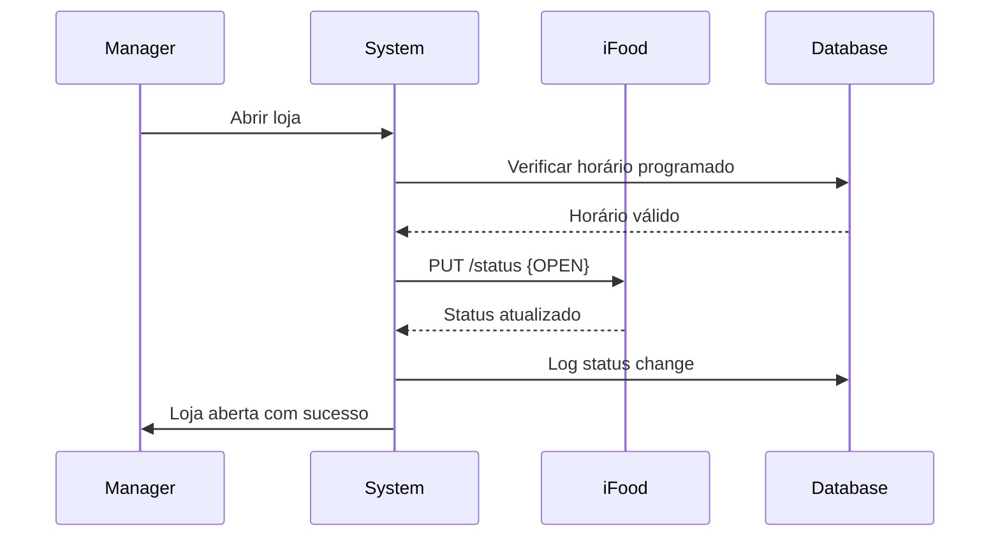
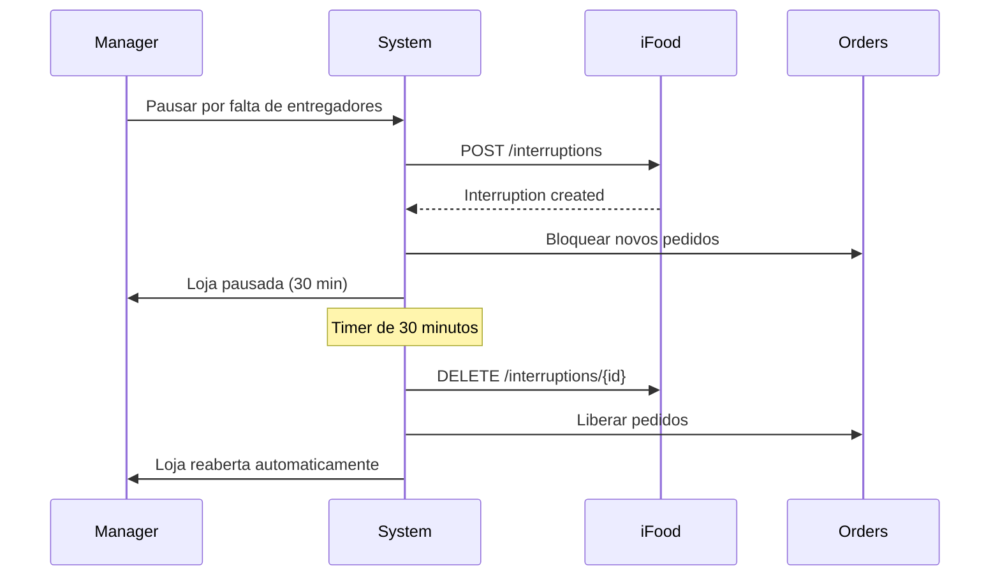

# 🏪 Merchant Module

## Visão Geral

O módulo **Merchant** é responsável pelo gerenciamento completo do estabelecimento no ecossistema iFood, incluindo configurações, status operacional, horários de funcionamento e informações do restaurante.

## Arquitetura do Módulo

```
┌─────────────────────────────────────────────────────────┐
│                    Merchant Module                       │
├─────────────────────────────────────────────────────────┤
│                                                          │
│  ┌──────────────┐  ┌──────────────┐  ┌──────────────┐  │
│  │   Settings   │  │    Status    │  │   Schedule   │  │
│  │  Management  │  │   Control    │  │   Manager    │  │
│  └──────────────┘  └──────────────┘  └──────────────┘  │
│                                                          │
│  ┌──────────────┐  ┌──────────────┐  ┌──────────────┐  │
│  │   Business   │  │   Financial  │  │   Analytics  │  │
│  │     Info     │  │    Config    │  │   Dashboard  │  │
│  └──────────────┘  └──────────────┘  └──────────────┘  │
│                                                          │
└─────────────────────────────────────────────────────────┘
```

## Componentes Principais

### 1. Merchant Configuration
**Localização**: `frontend/src/components/modules/IfoodApiConfig.tsx`

#### Funcionalidades
- **Gestão de Credenciais OAuth2**
- **Configuração de Merchant ID**
- **Seleção de Ambiente** (Sandbox/Production)
- **Validação de Conexão**

#### Interface de Dados
```typescript
interface MerchantConfig {
  merchantId: string
  businessName: string
  cnpj: string
  email: string
  phone: string
  address: {
    street: string
    number: string
    complement?: string
    neighborhood: string
    city: string
    state: string
    zipCode: string
    latitude: number
    longitude: number
  }
  category: 'RESTAURANT' | 'BAKERY' | 'GROCERY' | 'PHARMACY'
  deliveryRadius: number  // em km
  preparationTime: number // em minutos
}
```

### 2. Status Management
**Localização**: `services/ifood-token-service/src/merchantService.ts`

#### Estados do Estabelecimento
```typescript
enum MerchantStatus {
  OPEN = 'OPEN',                    // Aberto e recebendo pedidos
  CLOSED = 'CLOSED',                // Fechado temporariamente
  PAUSED = 'PAUSED',                // Pausado (não recebe novos pedidos)
  UNAVAILABLE = 'UNAVAILABLE',      // Indisponível no iFood
  MAINTENANCE = 'MAINTENANCE'       // Em manutenção
}

interface StatusChange {
  currentStatus: MerchantStatus
  newStatus: MerchantStatus
  reason?: string
  duration?: number  // minutos para retorno automático
  scheduledReturn?: Date
}
```

#### Operações de Status
```typescript
class MerchantStatusService {
  // Consultar status atual
  async getCurrentStatus(merchantId: string): Promise<MerchantStatus>
  
  // Abrir estabelecimento
  async openStore(merchantId: string): Promise<void>
  
  // Fechar estabelecimento
  async closeStore(merchantId: string, reason?: string): Promise<void>
  
  // Pausar temporariamente
  async pauseStore(merchantId: string, minutes: number): Promise<void>
  
  // Verificar se pode receber pedidos
  async canReceiveOrders(merchantId: string): Promise<boolean>
}
```

### 3. Opening Hours (Horários de Funcionamento)
**Localização**: `frontend/src/components/modules/OpeningHours.tsx`

#### Estrutura de Horários
```typescript
interface OpeningHours {
  dayOfWeek: DayOfWeek
  periods: Period[]
}

interface Period {
  start: string  // "09:00"
  end: string    // "22:00"
}

enum DayOfWeek {
  MONDAY = 1,
  TUESDAY = 2,
  WEDNESDAY = 3,
  THURSDAY = 4,
  FRIDAY = 5,
  SATURDAY = 6,
  SUNDAY = 0
}

interface SpecialSchedule {
  date: Date
  reason: 'HOLIDAY' | 'EVENT' | 'MAINTENANCE'
  periods?: Period[]  // null se fechado
  closed: boolean
}
```

#### Gerenciamento de Horários
```typescript
class ScheduleManager {
  // Definir horários regulares
  async setRegularHours(merchantId: string, hours: OpeningHours[]): Promise<void>
  
  // Adicionar horário especial
  async addSpecialSchedule(merchantId: string, special: SpecialSchedule): Promise<void>
  
  // Verificar se está aberto agora
  async isOpenNow(merchantId: string): Promise<boolean>
  
  // Próximo horário de abertura
  async getNextOpeningTime(merchantId: string): Promise<Date>
  
  // Validar pedido no horário
  async validateOrderTime(merchantId: string, orderTime: Date): Promise<boolean>
}
```

### 4. Interruptions (Interrupções)
**Documentado em**: `OPENING_HOURS_IMPLEMENTATION_SUMMARY.md`

#### Tipos de Interrupção
```typescript
interface Interruption {
  id: string
  type: 'SCHEDULED' | 'EMERGENCY' | 'SYSTEM'
  reason: InterruptionReason
  startTime: Date
  endTime?: Date
  message?: string
  autoResume: boolean
}

enum InterruptionReason {
  LACK_OF_DELIVERY = 'LACK_OF_DELIVERY',
  LACK_OF_PRODUCTS = 'LACK_OF_PRODUCTS', 
  TECHNICAL_ISSUES = 'TECHNICAL_ISSUES',
  OVERCAPACITY = 'OVERCAPACITY',
  SPECIAL_EVENT = 'SPECIAL_EVENT',
  WEATHER = 'WEATHER',
  OTHER = 'OTHER'
}
```

### 5. Financial Settings
**Localização**: `services/ifood-token-service/src/financialService.ts`

#### Configurações Financeiras
```typescript
interface FinancialConfig {
  merchantId: string
  bankAccount: {
    bank: string
    agency: string
    account: string
    type: 'CHECKING' | 'SAVINGS'
    holder: string
    document: string  // CPF ou CNPJ
  }
  taxSettings: {
    regime: 'SIMPLES' | 'PRESUMIDO' | 'REAL'
    municipalTax: number
    stateTax: number
  }
  commissions: {
    ifoodPercentage: number
    deliveryFee: number
    processingFee: number
  }
  minimumOrder: number
  deliveryFee: {
    base: number
    perKm: number
    freeDeliveryAbove?: number
  }
}
```

### 6. Merchant Analytics
**Localização**: `frontend/src/components/modules/MerchantDashboard.tsx`

#### Métricas do Estabelecimento
```typescript
interface MerchantMetrics {
  period: DateRange
  revenue: {
    total: number
    orders: number
    average: number
    growth: number  // % vs período anterior
  }
  orders: {
    total: number
    completed: number
    cancelled: number
    averageTime: number  // minutos
  }
  ratings: {
    average: number
    total: number
    distribution: Record<1|2|3|4|5, number>
  }
  operational: {
    uptime: number  // % do tempo aberto
    acceptanceRate: number  // % pedidos aceitos
    cancellationRate: number
    preparationTime: number  // média em minutos
  }
}
```

## API Endpoints

### Merchant Management
```typescript
// Obter informações do merchant
GET /api/merchant/:merchantId
Response: MerchantConfig

// Atualizar configurações
PUT /api/merchant/:merchantId
Body: Partial<MerchantConfig>
Response: MerchantConfig

// Status do estabelecimento
GET /api/merchant/:merchantId/status
Response: { status: MerchantStatus, canReceiveOrders: boolean }

// Alterar status
POST /api/merchant/:merchantId/status
Body: StatusChange
Response: { success: boolean, newStatus: MerchantStatus }
```

### Schedule Management
```typescript
// Obter horários
GET /api/merchant/:merchantId/schedule
Response: OpeningHours[]

// Atualizar horários
PUT /api/merchant/:merchantId/schedule
Body: OpeningHours[]
Response: { success: boolean }

// Adicionar interrupção
POST /api/merchant/:merchantId/interruption
Body: Interruption
Response: { success: boolean, interruptionId: string }

// Remover interrupção
DELETE /api/merchant/:merchantId/interruption/:interruptionId
Response: { success: boolean }
```

### Analytics
```typescript
// Métricas do merchant
GET /api/merchant/:merchantId/metrics
Query: { startDate, endDate, groupBy }
Response: MerchantMetrics

// Relatório financeiro
GET /api/merchant/:merchantId/financial-report
Query: { period, detailed }
Response: FinancialReport
```

## Integração com iFood API

### Endpoints iFood Utilizados
```http
# Status da loja
GET/PUT https://merchant-api.ifood.com.br/merchant/v1.0/merchants/{merchantId}/status

# Informações do merchant
GET https://merchant-api.ifood.com.br/merchant/v1.0/merchants/{merchantId}

# Horários de funcionamento
GET/PUT https://merchant-api.ifood.com.br/merchant/v1.0/merchants/{merchantId}/opening-hours

# Interrupções
POST https://merchant-api.ifood.com.br/merchant/v1.0/merchants/{merchantId}/interruptions
DELETE https://merchant-api.ifood.com.br/merchant/v1.0/merchants/{merchantId}/interruptions/{id}
```

## Database Schema

### Tabelas do Módulo
```sql
-- Informações do merchant
CREATE TABLE merchants (
  id UUID PRIMARY KEY DEFAULT gen_random_uuid(),
  merchant_id VARCHAR(255) UNIQUE NOT NULL,
  business_name VARCHAR(255) NOT NULL,
  cnpj VARCHAR(20) NOT NULL,
  email VARCHAR(255),
  phone VARCHAR(50),
  address JSONB,
  category VARCHAR(50),
  delivery_radius INTEGER,
  preparation_time INTEGER,
  settings JSONB,
  created_at TIMESTAMP DEFAULT NOW(),
  updated_at TIMESTAMP DEFAULT NOW()
);

-- Status e histórico
CREATE TABLE merchant_status_log (
  id UUID PRIMARY KEY DEFAULT gen_random_uuid(),
  merchant_id VARCHAR(255) NOT NULL,
  previous_status VARCHAR(50),
  new_status VARCHAR(50) NOT NULL,
  reason TEXT,
  changed_by VARCHAR(255),
  created_at TIMESTAMP DEFAULT NOW()
);

-- Horários de funcionamento
CREATE TABLE merchant_opening_hours (
  id UUID PRIMARY KEY DEFAULT gen_random_uuid(),
  merchant_id VARCHAR(255) NOT NULL,
  day_of_week INTEGER NOT NULL,
  start_time TIME NOT NULL,
  end_time TIME NOT NULL,
  active BOOLEAN DEFAULT true,
  created_at TIMESTAMP DEFAULT NOW(),
  UNIQUE(merchant_id, day_of_week, start_time)
);

-- Interrupções programadas
CREATE TABLE merchant_interruptions (
  id UUID PRIMARY KEY DEFAULT gen_random_uuid(),
  merchant_id VARCHAR(255) NOT NULL,
  interruption_id VARCHAR(255) UNIQUE,
  type VARCHAR(50) NOT NULL,
  reason VARCHAR(100) NOT NULL,
  message TEXT,
  start_time TIMESTAMP NOT NULL,
  end_time TIMESTAMP,
  auto_resume BOOLEAN DEFAULT false,
  created_at TIMESTAMP DEFAULT NOW()
);

-- Configurações financeiras
CREATE TABLE merchant_financial_config (
  id UUID PRIMARY KEY DEFAULT gen_random_uuid(),
  merchant_id VARCHAR(255) UNIQUE NOT NULL,
  bank_account JSONB,
  tax_settings JSONB,
  commissions JSONB,
  minimum_order DECIMAL(10,2),
  delivery_fee_config JSONB,
  created_at TIMESTAMP DEFAULT NOW(),
  updated_at TIMESTAMP DEFAULT NOW()
);

-- Índices para performance
CREATE INDEX idx_merchant_status ON merchants(merchant_id);
CREATE INDEX idx_status_log_merchant ON merchant_status_log(merchant_id, created_at DESC);
CREATE INDEX idx_opening_hours_merchant ON merchant_opening_hours(merchant_id, day_of_week);
CREATE INDEX idx_interruptions_active ON merchant_interruptions(merchant_id, start_time, end_time);
```

## Fluxos de Negócio

### 1. Abertura Diária da Loja


### 2. Interrupção de Emergência


## Monitoramento e Alertas

### KPIs do Merchant
```typescript
interface MerchantKPIs {
  // Operacional
  uptimePercentage: number       // Meta: >95%
  averageResponseTime: number    // Meta: <2min
  orderAcceptanceRate: number    // Meta: >90%
  
  // Financeiro
  dailyRevenue: number
  averageTicket: number
  commissionRate: number
  
  // Qualidade
  customerSatisfaction: number   // Meta: >4.5
  complaintRate: number          // Meta: <2%
  onTimeDeliveryRate: number     // Meta: >85%
}
```

### Alertas Automáticos
```typescript
enum AlertType {
  STORE_OFFLINE = 'STORE_OFFLINE',
  LOW_ACCEPTANCE = 'LOW_ACCEPTANCE',
  HIGH_CANCELLATION = 'HIGH_CANCELLATION',
  POOR_RATINGS = 'POOR_RATINGS',
  PREPARATION_DELAY = 'PREPARATION_DELAY'
}

interface Alert {
  type: AlertType
  severity: 'INFO' | 'WARNING' | 'CRITICAL'
  message: string
  timestamp: Date
  autoResolve: boolean
  actions?: string[]
}
```

## Melhores Práticas

### 1. Gestão de Horários
- Sempre manter horários atualizados no sistema
- Programar feriados com antecedência
- Usar interrupções programadas para manutenções

### 2. Status Management
- Nunca fechar sem motivo
- Usar pausas temporárias em vez de fechar
- Configurar retorno automático quando possível

### 3. Performance
- Cache de configurações do merchant (10 min)
- Atualização assíncrona de status
- Batch de logs para reduzir I/O

### 4. Segurança
- Validar merchant_id em todas operações
- Audit log de mudanças críticas
- Rate limiting em mudanças de status

## Troubleshooting

### Problemas Comuns

| Problema | Causa | Solução |
|----------|-------|---------|
| Loja não abre automaticamente | Horário não configurado | Verificar merchant_opening_hours |
| Status não sincroniza | Token expirado | Renovar token OAuth2 |
| Pedidos bloqueados | Interrupção ativa | Verificar merchant_interruptions |
| Métricas incorretas | Cache desatualizado | Limpar cache e recalcular |

## Roadmap

### Implementado ✅
- Configuração básica do merchant
- Gestão de status
- Horários de funcionamento
- Sistema de interrupções

### Em Desenvolvimento 🚧
- Dashboard analytics completo
- Gestão financeira integrada
- Alertas automáticos

### Planejado 📋
- Multi-merchant support
- Gestão de filiais
- Integração com ERP
- Machine learning para previsão de demanda