# 📦 Order Module

## Visão Geral

O módulo **Order** é o núcleo do sistema, gerenciando todo o ciclo de vida dos pedidos desde o recebimento até a conclusão. Integra-se com todos os outros módulos para fornecer uma experiência completa de gestão de pedidos.

## Arquitetura do Módulo

```
┌────────────────────────────────────────────────────────────────┐
│                         Order Module                           │
├────────────────────────────────────────────────────────────────┤
│                                                                │
│  ┌──────────────────────────────────────────────────────┐     │
│  │                  Order Lifecycle                      │     │
│  │  PENDING → CONFIRMED → PREPARING → READY_FOR_PICKUP   │     │
│  │     ↓                                    ↓            │     │
│  │  CANCELLED            DISPATCHED → DELIVERED          │     │
│  └──────────────────────────────────────────────────────┘     │
│                                                                │
│  ┌────────────┐  ┌────────────┐  ┌────────────┐              │
│  │   Order    │  │   Status   │  │  Payment   │              │
│  │  Manager   │  │   Engine   │  │  Handler   │              │
│  └────────────┘  └────────────┘  └────────────┘              │
│                                                                │
│  ┌────────────┐  ┌────────────┐  ┌────────────┐              │
│  │Preparation │  │   Timer    │  │Notification│              │
│  │  Tracker   │  │  Manager   │  │   Service  │              │
│  └────────────┘  └────────────┘  └────────────┘              │
│                                                                │
└────────────────────────────────────────────────────────────────┘
```

## Componentes Principais

### 1. Order Management
**Localização**: `frontend/src/components/modules/IfoodOrdersManager.tsx`

#### Estrutura de Dados
```typescript
interface Order {
  // Identificação
  id: string
  orderId: string
  externalId?: string
  merchantId: string
  
  // Status
  status: OrderStatus
  statusHistory: StatusChange[]
  
  // Cliente
  customer: Customer
  
  // Itens
  items: OrderItem[]
  totalItems: number
  
  // Valores
  subtotal: number
  deliveryFee: number
  totalAmount: number
  payment: Payment
  
  // Entrega
  deliveryMethod: 'DELIVERY' | 'PICKUP' | 'DINE_IN'
  deliveryAddress?: Address
  scheduledDelivery?: Date
  
  // Timestamps
  createdAt: Date
  confirmedAt?: Date
  preparingAt?: Date
  readyAt?: Date
  dispatchedAt?: Date
  deliveredAt?: Date
  cancelledAt?: Date
  
  // Metadados
  preparationTime: number  // minutos estimados
  notes?: string
  metadata?: OrderMetadata
}

enum OrderStatus {
  PENDING = 'PENDING',
  CONFIRMED = 'CONFIRMED',
  PREPARING = 'PREPARING',
  READY_FOR_PICKUP = 'READY_FOR_PICKUP',
  DISPATCHED = 'DISPATCHED',
  DELIVERED = 'DELIVERED',
  CANCELLED = 'CANCELLED',
  REFUNDED = 'REFUNDED'
}
```

### 2. Order Service
**Localização**: `services/ifood-token-service/src/ifoodOrderService.ts`

#### Operações Principais
```typescript
class OrderService {
  // Criação e importação
  async createOrderFromEvent(event: OrderPlacedEvent): Promise<Order>
  async importOrderDetails(orderId: string): Promise<Order>
  async processVirtualBag(orderId: string): Promise<OrderDetails>
  
  // Gestão de status
  async confirmOrder(orderId: string): Promise<void>
  async startPreparation(orderId: string): Promise<void>
  async markReadyForPickup(orderId: string): Promise<void>
  async dispatchOrder(orderId: string, driverId?: string): Promise<void>
  async completeOrder(orderId: string): Promise<void>
  
  // Cancelamento
  async cancelOrder(orderId: string, reason: CancelReason): Promise<void>
  async requestRefund(orderId: string, amount?: number): Promise<void>
  
  // Consultas
  async getOrder(orderId: string): Promise<Order>
  async listOrders(filters: OrderFilters): Promise<Order[]>
  async getOrdersByStatus(status: OrderStatus): Promise<Order[]>
  
  // Analytics
  async getOrderMetrics(merchantId: string, period: DateRange): Promise<OrderMetrics>
}
```

### 3. Customer Information
```typescript
interface Customer {
  id: string
  name: string
  phone: string
  email?: string
  cpf?: string
  
  // Endereço de entrega
  deliveryAddress?: {
    street: string
    number: string
    complement?: string
    neighborhood: string
    city: string
    state: string
    zipCode: string
    coordinates: {
      latitude: number
      longitude: number
    }
    reference?: string
  }
  
  // Histórico
  orderCount?: number
  totalSpent?: number
  lastOrderDate?: Date
  tags?: string[]
}
```

### 4. Order Items
```typescript
interface OrderItem {
  id: string
  productId: string
  name: string
  quantity: number
  unitPrice: number
  totalPrice: number
  
  // Modificadores e opções
  modifiers?: OrderModifier[]
  notes?: string
  
  // Status do item
  status: 'PENDING' | 'PREPARING' | 'READY' | 'DELIVERED'
  preparationTime?: number
}

interface OrderModifier {
  id: string
  name: string
  quantity: number
  price: number
}
```

### 5. Payment Processing
```typescript
interface Payment {
  method: PaymentMethod
  status: PaymentStatus
  
  // Valores
  subtotal: number
  deliveryFee: number
  discount?: number
  tip?: number
  totalAmount: number
  
  // Detalhes do pagamento
  card?: {
    brand: string
    lastFourDigits: string
  }
  
  pix?: {
    key: string
    qrCode?: string
  }
  
  cash?: {
    changeFor: number
  }
  
  // Transação
  transactionId?: string
  authorizationCode?: string
  processedAt?: Date
}

enum PaymentMethod {
  CREDIT_CARD = 'CREDIT_CARD',
  DEBIT_CARD = 'DEBIT_CARD',
  PIX = 'PIX',
  CASH = 'CASH',
  VOUCHER = 'VOUCHER',
  WALLET = 'WALLET'
}

enum PaymentStatus {
  PENDING = 'PENDING',
  PROCESSING = 'PROCESSING',
  AUTHORIZED = 'AUTHORIZED',
  CAPTURED = 'CAPTURED',
  REFUNDED = 'REFUNDED',
  FAILED = 'FAILED'
}
```

### 6. Status Management
```typescript
class StatusEngine {
  // Validações de transição
  canTransitionTo(currentStatus: OrderStatus, newStatus: OrderStatus): boolean
  
  // Executar transição
  async transition(orderId: string, newStatus: OrderStatus): Promise<void>
  
  // Callbacks de status
  onStatusChange(orderId: string, callback: StatusChangeCallback): void
  
  // Auto-transições
  scheduleAutoTransition(orderId: string, toStatus: OrderStatus, delay: number): void
  
  // Histórico
  getStatusHistory(orderId: string): StatusChange[]
}

interface StatusChange {
  fromStatus: OrderStatus
  toStatus: OrderStatus
  changedAt: Date
  changedBy: string
  reason?: string
}
```

## API Endpoints

### Order Management
```typescript
// Listar pedidos
GET /api/orders
Query: { 
  merchantId: string
  status?: OrderStatus
  startDate?: Date
  endDate?: Date
  customerId?: string
  page?: number
  limit?: number
}
Response: { orders: Order[], total: number }

// Obter pedido específico
GET /api/orders/:orderId
Response: Order

// Confirmar pedido
POST /api/orders/:orderId/confirm
Response: { success: boolean }

// Iniciar preparação
POST /api/orders/:orderId/start-preparation
Body: { estimatedTime?: number }
Response: { success: boolean }

// Marcar como pronto
POST /api/orders/:orderId/ready
Response: { success: boolean }

// Despachar pedido
POST /api/orders/:orderId/dispatch
Body: { driverId?: string }
Response: { success: boolean }

// Concluir pedido
POST /api/orders/:orderId/complete
Response: { success: boolean }

// Cancelar pedido
POST /api/orders/:orderId/cancel
Body: { reason: CancelReason, description?: string }
Response: { success: boolean }
```

### Order Analytics
```typescript
// Métricas de pedidos
GET /api/orders/metrics
Query: { merchantId, period, groupBy }
Response: OrderMetrics

// Relatório de vendas
GET /api/orders/sales-report
Query: { startDate, endDate }
Response: SalesReport

// Pedidos por status
GET /api/orders/by-status
Response: Record<OrderStatus, number>

// Tempo médio de preparação
GET /api/orders/preparation-time
Response: { average: number, byHour: Record<string, number> }
```

## Integração com iFood API

### Endpoints Utilizados
```http
# Obter detalhes do pedido
GET https://merchant-api.ifood.com.br/order/v1.0/orders/{orderId}

# Obter virtual bag (para Groceries)
GET https://merchant-api.ifood.com.br/order/v1.0/orders/{orderId}/virtual-bag

# Confirmar pedido
POST https://merchant-api.ifood.com.br/order/v1.0/orders/{orderId}/confirm

# Iniciar preparação
POST https://merchant-api.ifood.com.br/order/v1.0/orders/{orderId}/startPreparation

# Marcar como pronto
POST https://merchant-api.ifood.com.br/order/v1.0/orders/{orderId}/readyForPickup

# Despachar
POST https://merchant-api.ifood.com.br/order/v1.0/orders/{orderId}/dispatch

# Cancelar
POST https://merchant-api.ifood.com.br/order/v1.0/orders/{orderId}/cancel
Body: { cancellationCode: "501" }
```

## Database Schema

```sql
-- Tabela principal de pedidos
CREATE TABLE ifood_orders (
  id UUID PRIMARY KEY DEFAULT gen_random_uuid(),
  order_id VARCHAR(255) UNIQUE NOT NULL,
  external_id VARCHAR(255),
  merchant_id VARCHAR(255) NOT NULL,
  status VARCHAR(50) NOT NULL DEFAULT 'PENDING',
  
  -- Cliente
  customer_id VARCHAR(255),
  customer_name VARCHAR(255),
  customer_phone VARCHAR(50),
  customer_cpf VARCHAR(20),
  customer_email VARCHAR(255),
  
  -- Endereço
  delivery_method VARCHAR(50),
  delivery_address JSONB,
  delivery_lat DECIMAL(10, 8),
  delivery_lng DECIMAL(11, 8),
  
  -- Valores
  subtotal DECIMAL(10, 2),
  delivery_fee DECIMAL(10, 2),
  discount DECIMAL(10, 2),
  total_amount DECIMAL(10, 2),
  
  -- Pagamento
  payment_method VARCHAR(50),
  payment_status VARCHAR(50),
  payment_details JSONB,
  
  -- Itens
  items JSONB NOT NULL,
  total_items INTEGER,
  
  -- Tempos
  preparation_time INTEGER,
  estimated_delivery TIMESTAMP,
  
  -- Timestamps
  created_at TIMESTAMP NOT NULL,
  confirmed_at TIMESTAMP,
  preparing_at TIMESTAMP,
  ready_at TIMESTAMP,
  dispatched_at TIMESTAMP,
  delivered_at TIMESTAMP,
  cancelled_at TIMESTAMP,
  
  -- Metadados
  notes TEXT,
  metadata JSONB,
  updated_at TIMESTAMP DEFAULT NOW()
);

-- Histórico de status
CREATE TABLE order_status_history (
  id UUID PRIMARY KEY DEFAULT gen_random_uuid(),
  order_id VARCHAR(255) NOT NULL,
  from_status VARCHAR(50),
  to_status VARCHAR(50) NOT NULL,
  changed_by VARCHAR(255),
  reason TEXT,
  created_at TIMESTAMP DEFAULT NOW()
);

-- Itens do pedido (normalizado)
CREATE TABLE order_items (
  id UUID PRIMARY KEY DEFAULT gen_random_uuid(),
  order_id VARCHAR(255) NOT NULL,
  product_id VARCHAR(255),
  name VARCHAR(255) NOT NULL,
  quantity INTEGER NOT NULL,
  unit_price DECIMAL(10, 2),
  total_price DECIMAL(10, 2),
  modifiers JSONB,
  notes TEXT,
  status VARCHAR(50) DEFAULT 'PENDING',
  created_at TIMESTAMP DEFAULT NOW()
);

-- Timers e lembretes
CREATE TABLE order_timers (
  id UUID PRIMARY KEY DEFAULT gen_random_uuid(),
  order_id VARCHAR(255) NOT NULL,
  timer_type VARCHAR(50), -- 'AUTO_CANCEL', 'PREPARATION', 'DELIVERY'
  trigger_at TIMESTAMP NOT NULL,
  triggered BOOLEAN DEFAULT false,
  action VARCHAR(100),
  created_at TIMESTAMP DEFAULT NOW()
);

-- Índices
CREATE INDEX idx_orders_merchant ON ifood_orders(merchant_id);
CREATE INDEX idx_orders_status ON ifood_orders(status);
CREATE INDEX idx_orders_created ON ifood_orders(created_at DESC);
CREATE INDEX idx_orders_customer ON ifood_orders(customer_id);
CREATE INDEX idx_status_history_order ON order_status_history(order_id, created_at DESC);
CREATE INDEX idx_items_order ON order_items(order_id);
CREATE INDEX idx_timers_trigger ON order_timers(trigger_at, triggered);
```

## Fluxos de Negócio

### Fluxo Completo do Pedido

```mermaid
sequenceDiagram
    participant Customer
    participant iFood
    participant Events
    participant Order
    participant Kitchen
    participant Delivery
    
    Customer->>iFood: Fazer pedido
    iFood->>Events: PLACED event
    Events->>Order: Criar pedido
    Order->>Order: Status: PENDING
    Order->>Kitchen: Notificar novo pedido
    Kitchen->>Order: Confirmar pedido
    Order->>iFood: Confirm order
    Order->>Order: Status: CONFIRMED
    Order->>Kitchen: Iniciar preparação
    Order->>Order: Status: PREPARING
    Kitchen->>Order: Pronto para retirada
    Order->>Order: Status: READY_FOR_PICKUP
    Order->>Delivery: Solicitar entregador
    Delivery->>Order: Entregador designado
    Order->>Order: Status: DISPATCHED
    Delivery->>Customer: Entregar pedido
    Delivery->>Order: Confirmar entrega
    Order->>Order: Status: DELIVERED
    Order->>iFood: Order completed
```


## Funcionalidades Avançadas

### 1. Auto-cancelamento
```typescript
class AutoCancellation {
  // Configurar timer de auto-cancelamento
  scheduleAutoCancellation(orderId: string, timeout: number = 300000) // 5 min
  
  // Cancelar timer se pedido confirmado
  clearAutoCancellation(orderId: string)
  
  // Executar cancelamento
  executeAutoCancellation(orderId: string)
}
```

### 2. Preparation Tracking
```typescript
interface PreparationTracking {
  orderId: string
  startedAt: Date
  estimatedTime: number
  actualTime?: number
  items: Array<{
    itemId: string
    status: 'PENDING' | 'PREPARING' | 'READY'
    startedAt?: Date
    completedAt?: Date
  }>
  progress: number // 0-100%
}
```

### 3. Order Grouping
```typescript
class OrderGrouping {
  // Agrupar pedidos por entregador
  groupByDriver(orders: Order[]): Map<string, Order[]>
  
  // Agrupar por região
  groupByRegion(orders: Order[]): Map<string, Order[]>
  
  // Otimizar rota de entrega
  optimizeDeliveryRoute(orders: Order[]): Order[]
}
```

## Monitoramento

### KPIs Principais
```typescript
interface OrderKPIs {
  // Volume
  ordersToday: number
  ordersThisWeek: number
  ordersThisMonth: number
  
  // Performance
  averagePreparationTime: number
  averageDeliveryTime: number
  onTimeDeliveryRate: number
  
  // Qualidade
  cancellationRate: number
  refundRate: number
  customerSatisfaction: number
  
  // Financeiro
  revenueToday: number
  averageOrderValue: number
  
  // Operacional
  ordersInProgress: number
  ordersPending: number
  ordersDelayed: number
}
```

## Troubleshooting

| Problema | Causa | Solução |
|----------|-------|---------|
| Pedido travado em PENDING | Falha na confirmação | Reprocessar evento ou confirmar manualmente |
| Status não atualiza | Falha na sincronização | Verificar polling service |
| Pedido duplicado | Evento processado 2x | Verificar deduplicação |
| Timer não dispara | Job scheduler parado | Reiniciar timer service |

## Roadmap

### Implementado ✅
- Gestão completa do ciclo de pedidos
- Integração com eventos
- Sistema de status
- Auto-cancelamento
- Tracking de preparação

### Em Desenvolvimento 🚧
- Agrupamento inteligente de pedidos
- Previsão de tempo de entrega
- Sistema de priorização

### Planejado 📋
- Machine learning para previsão
- Otimização de rotas
- Split de pedidos
- Pedidos recorrentes