# ⭐ Review Module

## Visão Geral

O módulo **Review** gerencia todas as avaliações e feedback dos clientes, permitindo responder avaliações, analisar sentimentos, acompanhar métricas de satisfação e implementar melhorias baseadas no feedback recebido.

## Arquitetura do Módulo

```
┌──────────────────────────────────────────────────────────────┐
│                        Review Module                         │
├──────────────────────────────────────────────────────────────┤
│                                                              │
│  ┌──────────────────────────────────────────────────────┐   │
│  │                 Review Lifecycle                      │   │
│  │  NEW → ANALYZED → PENDING_REPLY → REPLIED            │   │
│  │                        ↓                              │   │
│  │                    ARCHIVED                           │   │
│  └──────────────────────────────────────────────────────┘   │
│                                                              │
│  ┌──────────┐  ┌──────────┐  ┌──────────┐  ┌──────────┐   │
│  │  Review  │  │Sentiment │  │  Reply   │  │Analytics │   │
│  │  Manager │  │ Analyzer │  │  Engine  │  │  Engine  │   │
│  └──────────┘  └──────────┘  └──────────┘  └──────────┘   │
│                                                              │
│  ┌──────────┐  ┌──────────┐  ┌──────────┐  ┌──────────┐   │
│  │ Template │  │   Auto   │  │  Alert   │  │  Report  │   │
│  │  Manager │  │  Reply   │  │  System  │  │Generator │   │
│  └──────────┘  └──────────┘  └──────────┘  └──────────┘   │
│                                                              │
└──────────────────────────────────────────────────────────────┘
```

## Componentes Principais

### 1. Review Management
**Localização**: `frontend/src/components/modules/IfoodReviewsManager.tsx`

#### Estrutura de Dados
```typescript
interface Review {
  // Identificação
  id: string
  reviewId: string
  orderId: string
  merchantId: string
  
  // Cliente
  customer: {
    id: string
    name: string
    orderCount?: number
    isVIP?: boolean
  }
  
  // Avaliação
  rating: number  // 1-5
  comment?: string
  
  // Aspectos avaliados
  aspects?: {
    food: number
    delivery: number
    packaging: number
    value: number
  }
  
  // Análise
  sentiment: 'POSITIVE' | 'NEUTRAL' | 'NEGATIVE'
  keywords: string[]
  topics: ReviewTopic[]
  priority: 'LOW' | 'MEDIUM' | 'HIGH' | 'CRITICAL'
  
  // Resposta
  reply?: ReviewReply
  
  // Status
  status: ReviewStatus
  
  // Timestamps
  createdAt: Date
  analyzedAt?: Date
  repliedAt?: Date
  
  // Metadados
  source: 'IFOOD' | 'GOOGLE' | 'FACEBOOK' | 'INSTAGRAM'
  visibility: 'PUBLIC' | 'PRIVATE'
  helpful: number  // Marcações como útil
}

enum ReviewStatus {
  NEW = 'NEW',
  ANALYZED = 'ANALYZED',
  PENDING_REPLY = 'PENDING_REPLY',
  REPLIED = 'REPLIED',
  ARCHIVED = 'ARCHIVED',
  FLAGGED = 'FLAGGED'
}

interface ReviewTopic {
  topic: string  // 'FOOD_QUALITY', 'DELIVERY_TIME', 'PRICE', etc
  sentiment: 'POSITIVE' | 'NEGATIVE'
  confidence: number  // 0-1
}
```

### 2. Sentiment Analysis
**Localização**: `services/ifood-token-service/src/sentimentAnalyzer.ts`

```typescript
class SentimentAnalyzer {
  // Analisar sentimento
  async analyzeSentiment(text: string): Promise<SentimentResult>
  
  // Extrair palavras-chave
  async extractKeywords(text: string): Promise<string[]>
  
  // Identificar tópicos
  async identifyTopics(text: string): Promise<ReviewTopic[]>
  
  // Calcular prioridade
  async calculatePriority(review: Review): Promise<Priority>
  
  // Detectar urgência
  async detectUrgency(text: string): Promise<boolean>
  
  // Analisar em lote
  async batchAnalyze(reviews: Review[]): Promise<AnalysisResult[]>
}

interface SentimentResult {
  sentiment: 'POSITIVE' | 'NEUTRAL' | 'NEGATIVE'
  score: number  // -1 a 1
  confidence: number  // 0-1
  
  // Emoções detectadas
  emotions?: {
    joy: number
    anger: number
    sadness: number
    surprise: number
    disgust: number
  }
  
  // Aspectos
  aspects: Array<{
    aspect: string
    sentiment: string
    score: number
  }>
}

interface Priority {
  level: 'LOW' | 'MEDIUM' | 'HIGH' | 'CRITICAL'
  reasons: string[]
  suggestedResponseTime: number  // minutos
}
```

### 3. Reply System
**Localização**: `services/ifood-token-service/src/replyService.ts`

```typescript
interface ReviewReply {
  id: string
  reviewId: string
  
  // Conteúdo
  message: string
  template?: string
  
  // Personalização
  personalized: boolean
  tone: 'FORMAL' | 'FRIENDLY' | 'APOLOGETIC' | 'GRATEFUL'
  
  // Autor
  repliedBy: string
  approvedBy?: string
  
  // Status
  status: 'DRAFT' | 'PENDING_APPROVAL' | 'SENT' | 'FAILED'
  
  // Timestamps
  createdAt: Date
  sentAt?: Date
  
  // Métricas
  characterCount: number
  readingTime: number  // segundos estimados
}

class ReplyService {
  // Gerar resposta sugerida
  async suggestReply(review: Review): Promise<string>
  
  // Personalizar resposta
  async personalizeReply(template: string, review: Review): Promise<string>
  
  // Enviar resposta
  async sendReply(reviewId: string, reply: string): Promise<void>
  
  // Aprovar resposta
  async approveReply(replyId: string, approverId: string): Promise<void>
  
  // Agendar resposta
  async scheduleReply(reviewId: string, reply: string, sendAt: Date): Promise<void>
  
  // Resposta em lote
  async batchReply(reviews: Review[], template: string): Promise<BatchReplyResult>
}
```

### 4. Template Management
```typescript
interface ReplyTemplate {
  id: string
  name: string
  category: TemplateCategory
  
  // Conteúdo
  content: string
  variables: string[]  // [CUSTOMER_NAME], [ORDER_ID], etc
  
  // Condições de uso
  conditions: {
    minRating?: number
    maxRating?: number
    sentiment?: string
    topics?: string[]
  }
  
  // Configurações
  tone: string
  language: string
  
  // Estatísticas
  usageCount: number
  effectiveness: number  // 0-100%
  
  // Status
  active: boolean
  createdAt: Date
  updatedAt: Date
}

enum TemplateCategory {
  THANK_YOU = 'THANK_YOU',
  APOLOGY = 'APOLOGY',
  EXPLANATION = 'EXPLANATION',
  COMPENSATION = 'COMPENSATION',
  FOLLOW_UP = 'FOLLOW_UP',
  GENERAL = 'GENERAL'
}

class TemplateManager {
  // CRUD de templates
  async createTemplate(template: ReplyTemplate): Promise<ReplyTemplate>
  async updateTemplate(id: string, updates: Partial<ReplyTemplate>): Promise<void>
  async deleteTemplate(id: string): Promise<void>
  
  // Buscar template apropriado
  async findBestTemplate(review: Review): Promise<ReplyTemplate>
  
  // Aplicar variáveis
  async applyVariables(template: string, data: any): Promise<string>
  
  // Testar template
  async testTemplate(template: string, review: Review): Promise<string>
}
```

### 5. Auto Reply System
```typescript
interface AutoReplyConfig {
  enabled: boolean
  
  // Critérios
  criteria: {
    minRating: number  // Responder apenas >= X estrelas
    maxResponseTime: number  // minutos
    excludeKeywords: string[]  // Não responder se contiver
    requireApproval: boolean
  }
  
  // Templates por rating
  templates: {
    excellent: string  // 5 estrelas
    good: string       // 4 estrelas
    neutral: string    // 3 estrelas
    poor: string       // 2 estrelas
    terrible: string   // 1 estrela
  }
  
  // Horário de funcionamento
  schedule: {
    enabled: boolean
    startTime: string  // "09:00"
    endTime: string    // "18:00"
    timezone: string
  }
}

class AutoReplyService {
  // Configurar auto-reply
  async configure(config: AutoReplyConfig): Promise<void>
  
  // Processar review para auto-reply
  async processReview(review: Review): Promise<AutoReplyResult>
  
  // Validar antes de enviar
  async validateReply(reply: string): Promise<ValidationResult>
  
  // Enfileirar para aprovação
  async queueForApproval(reviewId: string, reply: string): Promise<void>
}
```

### 6. Analytics Engine
**Localização**: `services/ifood-token-service/src/reviewAnalytics.ts`

```typescript
interface ReviewMetrics {
  period: DateRange
  
  // Volume
  totalReviews: number
  newReviews: number
  
  // Ratings
  averageRating: number
  ratingDistribution: Record<1|2|3|4|5, number>
  ratingTrend: 'UP' | 'DOWN' | 'STABLE'
  
  // Sentimento
  sentimentDistribution: {
    positive: number
    neutral: number
    negative: number
  }
  
  // Resposta
  responseRate: number
  averageResponseTime: number  // horas
  repliedCount: number
  
  // Tópicos principais
  topPositiveTopics: Topic[]
  topNegativeTopics: Topic[]
  
  // Comparações
  vsLastPeriod: {
    rating: number  // diferença
    volume: number  // %
    responseRate: number  // %
  }
  
  // Insights
  insights: Insight[]
}

interface Topic {
  name: string
  count: number
  sentiment: number
  examples: string[]  // Trechos de reviews
}

interface Insight {
  type: 'IMPROVEMENT' | 'ACHIEVEMENT' | 'WARNING' | 'OPPORTUNITY'
  title: string
  description: string
  impact: 'LOW' | 'MEDIUM' | 'HIGH'
  suggestedAction?: string
}

class ReviewAnalytics {
  // Métricas gerais
  async getMetrics(merchantId: string, period: DateRange): Promise<ReviewMetrics>
  
  // Análise de tendências
  async analyzeTrends(merchantId: string): Promise<TrendAnalysis>
  
  // Benchmark com concorrentes
  async benchmark(merchantId: string): Promise<BenchmarkResult>
  
  // Previsão de rating
  async predictRating(merchantId: string, days: number): Promise<number>
  
  // Gerar insights
  async generateInsights(metrics: ReviewMetrics): Promise<Insight[]>
  
  // Exportar relatório
  async exportReport(merchantId: string, format: 'PDF' | 'CSV' | 'JSON'): Promise<Buffer>
}
```

## API Endpoints

### Review Management
```typescript
// Listar avaliações
GET /api/reviews
Query: { 
  merchantId: string
  status?: ReviewStatus
  rating?: number
  sentiment?: string
  startDate?: Date
  endDate?: Date
  page?: number
  limit?: number
}
Response: { reviews: Review[], total: number }

// Obter review específica
GET /api/reviews/:reviewId
Response: Review

// Responder avaliação
POST /api/reviews/:reviewId/reply
Body: { message: string, template?: string }
Response: { success: boolean, replyId: string }

// Marcar como lida
PUT /api/reviews/:reviewId/mark-read
Response: { success: boolean }

// Arquivar review
PUT /api/reviews/:reviewId/archive
Response: { success: boolean }
```

### Templates
```typescript
// Listar templates
GET /api/reviews/templates
Query: { category?: TemplateCategory }
Response: ReplyTemplate[]

// Criar template
POST /api/reviews/templates
Body: ReplyTemplate
Response: ReplyTemplate

// Atualizar template
PUT /api/reviews/templates/:templateId
Body: Partial<ReplyTemplate>
Response: ReplyTemplate

// Deletar template
DELETE /api/reviews/templates/:templateId
Response: { success: boolean }

// Sugerir template
POST /api/reviews/:reviewId/suggest-template
Response: { template: ReplyTemplate, preview: string }
```

### Analytics
```typescript
// Métricas de reviews
GET /api/reviews/metrics
Query: { merchantId, startDate, endDate }
Response: ReviewMetrics

// Análise de sentimento
POST /api/reviews/analyze-sentiment
Body: { text: string }
Response: SentimentResult

// Tendências
GET /api/reviews/trends
Query: { merchantId, period }
Response: TrendAnalysis

// Exportar relatório
GET /api/reviews/export
Query: { merchantId, format, period }
Response: File download
```

### Auto Reply
```typescript
// Configurar auto-reply
PUT /api/reviews/auto-reply/config
Body: AutoReplyConfig
Response: { success: boolean }

// Status do auto-reply
GET /api/reviews/auto-reply/status
Response: { enabled: boolean, stats: AutoReplyStats }

// Fila de aprovação
GET /api/reviews/auto-reply/queue
Response: { pending: PendingReply[] }

// Aprovar resposta automática
POST /api/reviews/auto-reply/approve/:queueId
Response: { success: boolean }
```

## Integração com iFood API

[Veja especificação completa em IFOOD_REVIEW_API_SPECIFICATION.md]

```http
# Listar reviews
GET https://merchant-api.ifood.com.br/review/v1.0/merchants/{merchantId}/reviews

# Obter review específica
GET https://merchant-api.ifood.com.br/review/v1.0/reviews/{reviewId}

# Responder review
POST https://merchant-api.ifood.com.br/review/v1.0/reviews/{reviewId}/reply
Body: { message: "Resposta" }

# Métricas de reviews
GET https://merchant-api.ifood.com.br/review/v1.0/merchants/{merchantId}/metrics
```

## Database Schema

```sql
-- Reviews principais
CREATE TABLE ifood_reviews (
  id UUID PRIMARY KEY DEFAULT gen_random_uuid(),
  review_id VARCHAR(255) UNIQUE NOT NULL,
  order_id VARCHAR(255),
  merchant_id VARCHAR(255) NOT NULL,
  
  -- Cliente
  customer_id VARCHAR(255),
  customer_name VARCHAR(255),
  customer_order_count INTEGER,
  
  -- Avaliação
  rating INTEGER CHECK (rating >= 1 AND rating <= 5),
  comment TEXT,
  
  -- Análise
  sentiment VARCHAR(20),
  keywords TEXT[],
  topics JSONB,
  priority VARCHAR(20),
  
  -- Status
  status VARCHAR(50) DEFAULT 'NEW',
  visibility VARCHAR(20) DEFAULT 'PUBLIC',
  
  -- Timestamps
  created_at TIMESTAMP NOT NULL,
  analyzed_at TIMESTAMP,
  replied_at TIMESTAMP,
  
  -- Metadados
  source VARCHAR(50) DEFAULT 'IFOOD',
  helpful_count INTEGER DEFAULT 0,
  metadata JSONB
);

-- Respostas
CREATE TABLE ifood_review_replies (
  id UUID PRIMARY KEY DEFAULT gen_random_uuid(),
  review_id VARCHAR(255) REFERENCES ifood_reviews(review_id),
  message TEXT NOT NULL,
  template_id UUID,
  
  -- Personalização
  tone VARCHAR(50),
  personalized BOOLEAN DEFAULT false,
  
  -- Autor
  replied_by VARCHAR(255),
  approved_by VARCHAR(255),
  
  -- Status
  status VARCHAR(50) DEFAULT 'SENT',
  
  -- Timestamps
  created_at TIMESTAMP DEFAULT NOW(),
  sent_at TIMESTAMP,
  
  -- Métricas
  character_count INTEGER,
  reading_time INTEGER
);

-- Templates
CREATE TABLE review_templates (
  id UUID PRIMARY KEY DEFAULT gen_random_uuid(),
  name VARCHAR(255) NOT NULL,
  category VARCHAR(50),
  content TEXT NOT NULL,
  variables TEXT[],
  
  -- Condições
  conditions JSONB,
  
  -- Configurações
  tone VARCHAR(50),
  language VARCHAR(10) DEFAULT 'pt-BR',
  
  -- Estatísticas
  usage_count INTEGER DEFAULT 0,
  effectiveness DECIMAL(5,2),
  
  -- Status
  active BOOLEAN DEFAULT true,
  created_at TIMESTAMP DEFAULT NOW(),
  updated_at TIMESTAMP DEFAULT NOW()
);

-- Analytics agregado
CREATE TABLE review_analytics (
  id UUID PRIMARY KEY DEFAULT gen_random_uuid(),
  merchant_id VARCHAR(255) NOT NULL,
  date DATE NOT NULL,
  
  -- Métricas
  total_reviews INTEGER DEFAULT 0,
  average_rating DECIMAL(3,2),
  response_rate DECIMAL(5,2),
  avg_response_time_hours DECIMAL(5,2),
  
  -- Distribuição
  rating_distribution JSONB,
  sentiment_distribution JSONB,
  topic_distribution JSONB,
  
  created_at TIMESTAMP DEFAULT NOW(),
  UNIQUE(merchant_id, date)
);

-- Auto-reply config
CREATE TABLE auto_reply_config (
  id UUID PRIMARY KEY DEFAULT gen_random_uuid(),
  merchant_id VARCHAR(255) UNIQUE NOT NULL,
  enabled BOOLEAN DEFAULT false,
  criteria JSONB,
  templates JSONB,
  schedule JSONB,
  created_at TIMESTAMP DEFAULT NOW(),
  updated_at TIMESTAMP DEFAULT NOW()
);

-- Índices
CREATE INDEX idx_reviews_merchant ON ifood_reviews(merchant_id, created_at DESC);
CREATE INDEX idx_reviews_status ON ifood_reviews(status);
CREATE INDEX idx_reviews_rating ON ifood_reviews(rating);
CREATE INDEX idx_reviews_sentiment ON ifood_reviews(sentiment);
CREATE INDEX idx_replies_review ON ifood_review_replies(review_id);
CREATE INDEX idx_templates_active ON review_templates(active, category);
CREATE INDEX idx_analytics_merchant_date ON review_analytics(merchant_id, date DESC);
```

## Fluxo de Processamento

```mermaid
sequenceDiagram
    participant Customer
    participant iFood
    participant System
    participant Analyzer
    participant Manager
    
    Customer->>iFood: Deixar avaliação
    iFood->>System: Nova review
    System->>Analyzer: Analisar sentimento
    Analyzer-->>System: Análise completa
    System->>System: Calcular prioridade
    
    alt Rating <= 3
        System->>Manager: Alerta urgente
        Manager->>System: Responder review
    else Auto-reply enabled
        System->>System: Gerar resposta
        System->>Manager: Aprovar resposta
    else Rating > 3
        System->>Manager: Notificar
    end
    
    Manager->>System: Enviar resposta
    System->>iFood: POST reply
    iFood->>Customer: Resposta publicada
```



## Funcionalidades Avançadas

### 1. AI-Powered Responses
```typescript
class AIResponseGenerator {
  // Gerar resposta com IA
  async generateResponse(review: Review): Promise<string>
  
  // Melhorar resposta existente
  async improveResponse(original: string): Promise<string>
  
  // Traduzir resposta
  async translateResponse(text: string, targetLang: string): Promise<string>
  
  // Verificar tom
  async checkTone(text: string): Promise<ToneAnalysis>
}
```

### 2. Competitor Analysis
```typescript
class CompetitorAnalysis {
  // Comparar ratings
  async compareRatings(merchantId: string): Promise<ComparisonResult>
  
  // Analisar reviews de concorrentes
  async analyzeCompetitorReviews(competitorId: string): Promise<Analysis>
  
  // Identificar diferenciais
  async identifyDifferentiators(merchantId: string): Promise<string[]>
}
```

### 3. Customer Journey Mapping
```typescript
class CustomerJourney {
  // Mapear jornada do cliente
  async mapJourney(customerId: string): Promise<Journey>
  
  // Identificar pontos de fricção
  async identifyPainPoints(reviews: Review[]): Promise<PainPoint[]>
  
  // Sugerir melhorias
  async suggestImprovements(painPoints: PainPoint[]): Promise<Improvement[]>
}
```

## Monitoramento

### KPIs Principais
```typescript
interface ReviewKPIs {
  // Qualidade
  averageRating: number  // Meta: >= 4.5
  nps: number  // Net Promoter Score
  
  // Engajamento
  responseRate: number  // Meta: >= 90%
  responseTime: number  // Meta: < 2 horas
  
  // Volume
  reviewsPerDay: number
  reviewGrowthRate: number
  
  // Satisfação
  positiveReviewRate: number  // Meta: >= 80%
  repeatCustomerReviews: number
}
```

## Troubleshooting

| Problema | Causa | Solução |
|----------|-------|---------|
| Reviews não sincronizam | API timeout | Verificar token e retry |
| Análise incorreta | Modelo desatualizado | Retreinar modelo de sentimento |
| Auto-reply não funciona | Config incorreta | Verificar auto_reply_config |
| Template não aplica | Variáveis faltando | Validar dados do template |

## Roadmap

### Implementado ✅
- Gestão completa de reviews
- Sistema de respostas
- Templates personalizáveis
- Análise de sentimento
- Métricas e relatórios

### Em Desenvolvimento 🚧
- Auto-reply inteligente
- IA para geração de respostas
- Análise de concorrentes
- Dashboard avançado

### Planejado 📋
- Integração com redes sociais
- Voice of Customer (VoC)
- Predictive analytics
- Gamificação para equipe