# 🚚 Shipping Module

## Visão Geral

O módulo **Shipping** gerencia todo o processo de entrega, desde a atribuição de entregadores até o rastreamento em tempo real e conclusão da entrega. Inclui funcionalidades avançadas como Safe Delivery, mudança de endereço e analytics geográfico.

## Arquitetura do Módulo

```
┌─────────────────────────────────────────────────────────────┐
│                      Shipping Module                        │
├─────────────────────────────────────────────────────────────┤
│                                                             │
│  ┌─────────────────────────────────────────────────────┐   │
│  │              Delivery Lifecycle                      │   │
│  │  PENDING → ASSIGNED → PICKED_UP → IN_TRANSIT        │   │
│  │                              ↓                       │   │
│  │            ARRIVED → DELIVERED/RETURNED             │   │
│  └─────────────────────────────────────────────────────┘   │
│                                                             │
│  ┌──────────┐  ┌──────────┐  ┌──────────┐  ┌──────────┐  │
│  │ Driver   │  │ Tracking │  │   Map    │  │   Safe   │  │
│  │ Manager  │  │  Engine  │  │ Service  │  │ Delivery │  │
│  └──────────┘  └──────────┘  └──────────┘  └──────────┘  │
│                                                             │
│  ┌──────────┐  ┌──────────┐  ┌──────────┐  ┌──────────┐  │
│  │ Address  │  │  Route   │  │Analytics │  │ Heatmap  │  │
│  │  Change  │  │Optimizer │  │  Engine  │  │Generator │  │
│  └──────────┘  └──────────┘  └──────────┘  └──────────┘  │
│                                                             │
└─────────────────────────────────────────────────────────────┘
```

## Componentes Principais

### 1. Shipping Manager
**Localização**: `frontend/src/components/modules/IfoodShippingManager.tsx`

#### Estrutura de Dados
```typescript
interface Shipping {
  // Identificação
  id: string
  orderId: string
  merchantId: string
  
  // Status
  status: ShippingStatus
  statusHistory: ShippingStatusChange[]
  
  // Entregador
  driver: Driver
  
  // Localizações
  origin: Location
  destination: Location
  currentLocation: Location
  route: Route
  
  // Tempos
  assignedAt: Date
  pickedUpAt?: Date
  estimatedDelivery: Date
  actualDelivery?: Date
  
  // Tracking
  trackingCode: string
  trackingUrl: string
  
  // Safe Delivery
  safeDelivery?: SafeDelivery
  
  // Mudança de endereço
  addressChange?: AddressChangeRequest
}

enum ShippingStatus {
  PENDING = 'PENDING',
  DRIVER_ASSIGNED = 'DRIVER_ASSIGNED',
  GOING_TO_ORIGIN = 'GOING_TO_ORIGIN',
  ARRIVED_AT_ORIGIN = 'ARRIVED_AT_ORIGIN',
  PICKED_UP = 'PICKED_UP',
  IN_TRANSIT = 'IN_TRANSIT',
  ARRIVED_AT_DESTINATION = 'ARRIVED_AT_DESTINATION',
  DELIVERED = 'DELIVERED',
  RETURNED = 'RETURNED',
  CANCELLED = 'CANCELLED'
}
```

### 2. Driver Management
```typescript
interface Driver {
  id: string
  name: string
  phone: string
  cpf?: string
  photo?: string
  rating: number
  
  // Veículo
  vehicle: {
    type: 'MOTORCYCLE' | 'BICYCLE' | 'CAR' | 'ON_FOOT'
    plate?: string
    model?: string
    color?: string
  }
  
  // Status
  status: 'AVAILABLE' | 'BUSY' | 'OFFLINE'
  currentLocation: Location
  
  // Estatísticas
  deliveriesToday: number
  averageDeliveryTime: number
  successRate: number
}

class DriverService {
  // Atribuir entregador
  async assignDriver(orderId: string, driverId?: string): Promise<Driver>
  
  // Liberar entregador
  async releaseDriver(driverId: string): Promise<void>
  
  // Rastrear localização
  async updateLocation(driverId: string, location: Location): Promise<void>
  
  // Buscar entregadores próximos
  async findNearbyDrivers(location: Location, radius: number): Promise<Driver[]>
  
  // Avaliar entregador
  async rateDriver(driverId: string, rating: number, comment?: string): Promise<void>
}
```

### 3. Real-time Tracking
**Localização**: `services/ifood-token-service/src/trackingService.ts`

```typescript
interface TrackingData {
  orderId: string
  driverId: string
  currentLocation: Location
  speed: number  // km/h
  heading: number  // graus
  accuracy: number  // metros
  timestamp: Date
  
  // Progresso
  distanceTraveled: number  // km
  distanceRemaining: number  // km
  timeElapsed: number  // minutos
  estimatedTimeRemaining: number  // minutos
  
  // Eventos
  events: TrackingEvent[]
}

interface TrackingEvent {
  type: 'LOCATION_UPDATE' | 'STATUS_CHANGE' | 'STOP' | 'DEVIATION'
  timestamp: Date
  location: Location
  data?: any
}

class TrackingService {
  // Iniciar rastreamento
  async startTracking(orderId: string): Promise<string>
  
  // Atualizar localização
  async updateLocation(trackingId: string, location: Location): Promise<void>
  
  // Obter tracking em tempo real
  async getTracking(trackingId: string): Promise<TrackingData>
  
  // Gerar link público
  async generatePublicLink(orderId: string): Promise<string>
  
  // Detectar desvios
  async detectRouteDeviation(trackingId: string): Promise<boolean>
  
  // Parar rastreamento
  async stopTracking(trackingId: string): Promise<void>
}
```

### 4. Safe Delivery
```typescript
interface SafeDelivery {
  enabled: boolean
  score: number  // 0-100
  riskLevel: 'LOW' | 'MEDIUM' | 'HIGH'
  
  // Fatores de risco
  factors: {
    locationRisk: number
    timeRisk: number  // horário da entrega
    weatherRisk: number
    historicalRisk: number
  }
  
  // Medidas de segurança
  measures: {
    photoRequired: boolean
    codeRequired: boolean
    signatureRequired: boolean
    contactlessDelivery: boolean
  }
  
  // Verificação
  verification?: {
    code?: string
    photo?: string
    signature?: string
    verifiedAt?: Date
  }
}

class SafeDeliveryService {
  // Calcular score de risco
  async calculateRiskScore(order: Order): Promise<number>
  
  // Gerar código de verificação
  async generateVerificationCode(orderId: string): Promise<string>
  
  // Validar entrega
  async validateDelivery(orderId: string, verification: any): Promise<boolean>
  
  // Reportar incidente
  async reportIncident(orderId: string, incident: SecurityIncident): Promise<void>
}
```

### 5. Address Change
```typescript
interface AddressChangeRequest {
  id: string
  orderId: string
  
  // Endereços
  originalAddress: Address
  newAddress: Address
  distance: number  // km entre endereços
  
  // Financeiro
  additionalFee: number
  feeAccepted?: boolean
  
  // Status
  status: 'PENDING' | 'ACCEPTED' | 'REJECTED' | 'EXPIRED'
  requestedAt: Date
  deadline: Date  // 15 minutos padrão
  respondedAt?: Date
  
  // Resposta
  response?: {
    accepted: boolean
    reason?: string
    respondedBy: string
  }
}

class AddressChangeService {
  // Solicitar mudança
  async requestChange(orderId: string, newAddress: Address): Promise<AddressChangeRequest>
  
  // Calcular taxa adicional
  async calculateAdditionalFee(original: Address, new: Address): Promise<number>
  
  // Aceitar mudança
  async acceptChange(requestId: string): Promise<void>
  
  // Rejeitar mudança
  async rejectChange(requestId: string, reason: string): Promise<void>
  
  // Verificar expiração
  async checkExpiredRequests(): Promise<void>
}
```

### 6. Route Optimization
```typescript
interface Route {
  id: string
  points: RoutePoint[]
  totalDistance: number  // km
  estimatedTime: number  // minutos
  
  // Otimização
  optimized: boolean
  algorithm: 'SHORTEST' | 'FASTEST' | 'BALANCED'
  
  // Waypoints
  waypoints?: Waypoint[]
  
  // Polilinha para mapa
  polyline: string
  bounds: LatLngBounds
}

interface RoutePoint {
  location: Location
  arrivalTime: Date
  departureTime?: Date
  stopDuration?: number  // minutos
  type: 'ORIGIN' | 'WAYPOINT' | 'DESTINATION'
}

class RouteOptimizer {
  // Calcular rota otimizada
  async optimizeRoute(points: Location[]): Promise<Route>
  
  // Adicionar parada
  async addWaypoint(routeId: string, location: Location): Promise<Route>
  
  // Recalcular com tráfego
  async recalculateWithTraffic(routeId: string): Promise<Route>
  
  // Agrupar entregas
  async groupDeliveries(orders: Order[]): Promise<Route[]>
}
```

## Map Integration
**Localização**: `frontend/src/components/modules/ShippingMap.tsx`

### Visualizações do Mapa
```typescript
interface MapConfig {
  center: Location
  zoom: number
  style: 'streets' | 'satellite' | 'hybrid'
  
  // Camadas
  layers: {
    traffic: boolean
    heatmap: boolean
    deliveryZones: boolean
    drivers: boolean
  }
  
  // Controles
  controls: {
    zoom: boolean
    fullscreen: boolean
    location: boolean
    layers: boolean
  }
}

interface MapMarker {
  id: string
  location: Location
  type: 'RESTAURANT' | 'CUSTOMER' | 'DRIVER' | 'WAYPOINT'
  icon: string
  label?: string
  popup?: string
  draggable?: boolean
}

class ShippingMap {
  // Adicionar marcadores
  addMarker(marker: MapMarker): void
  
  // Desenhar rota
  drawRoute(route: Route): void
  
  // Atualizar posição do entregador
  updateDriverPosition(driverId: string, location: Location): void
  
  // Mostrar heatmap
  showHeatmap(data: HeatmapData): void
  
  // Centralizar mapa
  centerMap(location: Location, zoom?: number): void
  
  // Fit bounds
  fitBounds(bounds: LatLngBounds): void
}
```

## Delivery Analytics
[Veja documento completo em DELIVERY_ANALYTICS_GUIDE.md]

### Métricas Principais
```typescript
interface DeliveryMetrics {
  // Performance
  averageDeliveryTime: number
  onTimeRate: number
  
  // Volume
  deliveriesToday: number
  deliveriesThisWeek: number
  
  // Geográfico
  deliveriesByRegion: Map<string, number>
  hotspots: Location[]
  
  // Qualidade
  customerSatisfaction: number
  driverRating: number
  incidentRate: number
}
```

## API Endpoints

### Shipping Management
```typescript
// Obter status da entrega
GET /api/shipping/:orderId
Response: Shipping

// Atribuir entregador
POST /api/shipping/:orderId/assign-driver
Body: { driverId?: string }
Response: { driver: Driver }

// Atualizar localização
PUT /api/shipping/:orderId/location
Body: { location: Location }
Response: { success: boolean }

// Confirmar retirada
POST /api/shipping/:orderId/pickup
Response: { success: boolean }

// Confirmar entrega
POST /api/shipping/:orderId/deliver
Body: { verification?: any }
Response: { success: boolean }
```

### Tracking
```typescript
// Obter tracking em tempo real
GET /api/tracking/:trackingCode
Response: TrackingData

// Tracking público (sem auth)
GET /api/public/tracking/:trackingCode
Response: PublicTrackingData

// WebSocket para updates
WS /api/tracking/:orderId/subscribe
```

### Address Change
```typescript
// Solicitar mudança
POST /api/shipping/:orderId/address-change
Body: { newAddress: Address }
Response: AddressChangeRequest

// Aceitar mudança
POST /api/shipping/address-change/:requestId/accept
Response: { success: boolean }

// Rejeitar mudança
POST /api/shipping/address-change/:requestId/reject
Body: { reason: string }
Response: { success: boolean }
```

## Database Schema

```sql
-- Status de entrega
CREATE TABLE ifood_shipping_status (
  id UUID PRIMARY KEY DEFAULT gen_random_uuid(),
  order_id VARCHAR(255) UNIQUE NOT NULL,
  status VARCHAR(50) NOT NULL,
  
  -- Entregador
  driver_id VARCHAR(255),
  driver_name VARCHAR(255),
  driver_phone VARCHAR(50),
  driver_cpf VARCHAR(20),
  vehicle_type VARCHAR(50),
  vehicle_plate VARCHAR(20),
  
  -- Localizações
  origin_lat DECIMAL(10, 8),
  origin_lng DECIMAL(11, 8),
  destination_lat DECIMAL(10, 8),
  destination_lng DECIMAL(11, 8),
  current_lat DECIMAL(10, 8),
  current_lng DECIMAL(11, 8),
  
  -- Tracking
  tracking_code VARCHAR(100) UNIQUE,
  tracking_url TEXT,
  
  -- Tempos
  assigned_at TIMESTAMP,
  picked_up_at TIMESTAMP,
  estimated_delivery TIMESTAMP,
  delivered_at TIMESTAMP,
  
  -- Safe Delivery
  safe_delivery_score INTEGER,
  verification_code VARCHAR(20),
  verification_photo TEXT,
  
  created_at TIMESTAMP DEFAULT NOW(),
  updated_at TIMESTAMP DEFAULT NOW()
);

-- Tracking em tempo real
CREATE TABLE shipping_tracking (
  id UUID PRIMARY KEY DEFAULT gen_random_uuid(),
  order_id VARCHAR(255) NOT NULL,
  driver_id VARCHAR(255),
  latitude DECIMAL(10, 8) NOT NULL,
  longitude DECIMAL(11, 8) NOT NULL,
  speed DECIMAL(5, 2),
  heading INTEGER,
  accuracy DECIMAL(5, 2),
  timestamp TIMESTAMP NOT NULL
);

-- Mudanças de endereço
CREATE TABLE ifood_address_changes (
  id UUID PRIMARY KEY DEFAULT gen_random_uuid(),
  order_id VARCHAR(255) NOT NULL,
  original_address JSONB NOT NULL,
  new_address JSONB NOT NULL,
  distance_km DECIMAL(5, 2),
  additional_fee DECIMAL(10, 2),
  status VARCHAR(50) DEFAULT 'PENDING',
  deadline TIMESTAMP NOT NULL,
  response JSONB,
  created_at TIMESTAMP DEFAULT NOW(),
  responded_at TIMESTAMP
);

-- Analytics de entrega
CREATE TABLE delivery_analytics (
  id UUID PRIMARY KEY DEFAULT gen_random_uuid(),
  merchant_id VARCHAR(255) NOT NULL,
  date DATE NOT NULL,
  region VARCHAR(255),
  total_deliveries INTEGER DEFAULT 0,
  average_time INTEGER,
  on_time_rate DECIMAL(5, 2),
  incident_count INTEGER DEFAULT 0,
  created_at TIMESTAMP DEFAULT NOW(),
  UNIQUE(merchant_id, date, region)
);

-- Índices
CREATE INDEX idx_shipping_order ON ifood_shipping_status(order_id);
CREATE INDEX idx_shipping_status ON ifood_shipping_status(status);
CREATE INDEX idx_tracking_order ON shipping_tracking(order_id, timestamp DESC);
CREATE INDEX idx_address_change_order ON ifood_address_changes(order_id);
CREATE INDEX idx_analytics_merchant_date ON delivery_analytics(merchant_id, date DESC);
```

## Integração com iFood API

```http
# Status da entrega
GET https://merchant-api.ifood.com.br/order/v1.0/orders/{orderId}/shipping

# Tracking do entregador
GET https://merchant-api.ifood.com.br/order/v1.0/orders/{orderId}/tracking

# Aceitar mudança de endereço
POST https://merchant-api.ifood.com.br/order/v1.0/orders/{orderId}/address-change/accept

# Rejeitar mudança
POST https://merchant-api.ifood.com.br/order/v1.0/orders/{orderId}/address-change/reject
```

## Fluxo de Entrega

```mermaid
sequenceDiagram
    participant Order
    participant Shipping
    participant Driver
    participant Customer
    participant Map
    
    Order->>Shipping: Pedido pronto
    Shipping->>Driver: Buscar entregador
    Driver-->>Shipping: Aceitar entrega
    Shipping->>Map: Iniciar tracking
    Driver->>Shipping: Chegou ao restaurante
    Driver->>Shipping: Retirou pedido
    loop Tracking
        Driver->>Map: Atualizar localização
        Map->>Customer: Mostrar posição
    end
    Driver->>Customer: Entregar pedido
    Customer->>Shipping: Confirmar recebimento
    Shipping->>Order: Entrega concluída
```



## Roadmap

### Implementado ✅
- Gestão completa de entregas
- Tracking em tempo real
- Safe Delivery
- Mudança de endereço
- Mapas interativos
- Analytics básico

### Em Desenvolvimento 🚧
- Otimização de rotas
- Agrupamento de entregas
- Previsão com machine learning
- Dashboard analytics avançado

### Planejado 📋
- Entrega por drones
- Integração com múltiplos couriers
- Blockchain para rastreabilidade
- AR para navegação de entregadores